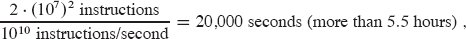
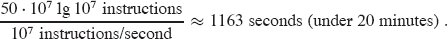
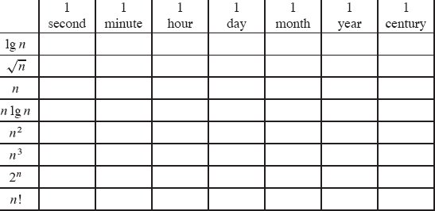

# 算法在计算中的作用

什么是算法？ 为什么算法的研究值得？ 相对于计算机中使用的其他技术，算法的作用是什么？ 本章将回答这些问题。

## 1.1      算法

非正式地，***算法***是任何定义明确的计算过程，它以某个值或一组值作为***输入***，并在有限的时间内产生一些值或一组值作为***输出***。因此，算法是将输入转换为输出的一系列计算步骤。
你还可以将算法视为解决明确指定的***计算问题***的工具。问题的陈述一般规定了问题实例所需的输入/输出关系，通常是任意大的大小。该算法描述了为所有问题实例实现该输入/输出关系的特定计算过程。
例如，假设你需要将一个数字序列排序为单调递增的顺序。这个问题在实践中经常出现，为引入许多标准设计技术和分析工具提供了沃土。以下是我们正式定义***排序问题***的方式：
输入：一个由 n 个数字组成的序列 <a~1~, a~2~, ... , a~n~>。

输出：输入序列的排列（重新排序）<a^‘^~1~, a^‘^~2~, ..., a^‘^~n~>，使得 $ a{^\prime_1} \leq a{^\prime_2} \leq \ldots \leq a{^\prime_n} $.

因此，给定输入序列 <31, 41, 59, 26, 41, 58>，正确的排序算法将返回序列 <26, 31, 41, 41, 58, 59> 作为输出。这样的输入序列称为排序问题的一个***实例***。一般来说，问题的一个实例由计算问题解决方案所需的输入（满足问题陈述中施加的任何约束）组成。
由于许多程序将其用作中间步骤，因此排序是计算机科学中的一项基本操作。因此，你可以使用大量优秀的排序算法。哪种算法最适合给定应用程序取决于（除其他因素外）要排序的项目数量、项目已经排序的程度、项目值的可能限制、计算机的体系结构和类型要使用的存储设备：主存储器、磁盘，甚至——在古代——磁带。
一个计算问题的算法是正确的，如果对于作为输入提供的每个问题实例，它停止——在有限时间内完成它的计算——并输出问题实例的正确解决方案。正确的算法可以解决给定的计算问题。不正确的算法可能在某些输入实例上根本不会停止，或者它可能会因错误的答案而停止。与你的预期相反，如果你可以控制错误率，错误的算法有时会很有用。在第 31 章研究查找大素数的算法时，我们将看到一个错误率可控的算法示例。然而，通常我们只关心正确的算法。
算法可以用英语指定为计算机程序，甚至可以指定为硬件设计。唯一的要求是规范必须提供要遵循的计算过程的精确描述。

### 算法解决了哪些问题？

排序绝不是开发算法的唯一计算问题。 （当你看到这本书的篇幅时，你可能也有同样的怀疑。）算法的实际应用无处不在，包括以下示例：

- 人类基因组计划在识别人类 DNA 中所有大约 30,000 个基因、确定构成人类 DNA 的大约 30 亿个化学碱基对的序列、将这些信息存储在数据库中以及开发数据工具的目标方面取得了巨大进展分析。这些步骤中的每一个都需要复杂的算法。尽管所涉及的各种问题的解决方案超出了本书的范围，但许多解决这些生物学问题的方法都使用了这里提出的想法，使科学家能够在有效利用资源的同时完成任务。与第 14 章一样，动态编程是解决其中几个生物学问题的重要技术，尤其是那些涉及确定 DNA 序列之间相似性的问题。由于可以通过实验室技术提取更多信息，因此实现的节省是时间上的，包括人力和机器上的，以及金钱上的。
- 互联网使世界各地的人们能够快速访问和检索大量信息。借助巧妙的算法，互联网上的网站能够管理和操纵如此大量的数据。必须使用算法的问题示例包括寻找数据传输的良好路径（解决此类问题的技术见第 22 章），以及使用搜索引擎快速查找特定信息所在的页面（相关技术见章节11 和 32）。
- 电子商务使商品和服务能够以电子方式进行协商和交换，它依赖于信用卡号、密码和银行对账单等个人信息的隐私。电子商务中使用的核心技术包括基于数值算法和数论的公钥密码学和数字签名（在第 31 章中介绍）。
- 制造业和其他商业企业往往需要以最有利的方式分配稀缺资源。一家石油公司可能希望知道将其油井放置在何处以最大化其预期利润。政治候选人可能希望确定在哪里花钱购买广告系列广告，以最大限度地提高选举的机会。航空公司可能希望以尽可能最便宜的方式将机组人员分配到航班上，确保覆盖每个航班并满足有关机组人员调度的政府规定。互联网服务提供商可能希望确定在哪里放置额外资源以便更有效地为其客户服务。所有这些都是可以通过将它们建模为线性程序来解决的问题示例，第 29 章将对此进行探讨。

尽管这些示例的某些细节超出了本书的范围，但我们确实提供了适用于这些问题和问题领域的基础技术。我们还展示了如何解决许多具体问题，包括：

- 你有一张路线图，上面标记了每对相邻交叉口之间的距离，并且你希望确定从一个交叉口到另一个交叉口的最短路线。即使你不允许跨越自身的路线，可能的路线的数量也可能很大。你如何选择所有可能的路线中最短的路线？你可以首先将路线图（它本身就是实际道路的模型）建模为图形（我们将在第 VI 部分和附录 B 中介绍）。在此图中，你希望找到从一个顶点到另一个顶点的最短路径。第 22 章展示了如何有效地解决这个问题。
- 给定根据零件库的机械设计，其中每个零件可能包含其他零件的实例，按顺序列出零件，以便每个零件出现在使用它的任何零件之前。如果设计包含 n 个部分，则有 n!可能的订单，其中 n!表示阶乘函数。因为阶乘函数的增长速度甚至比指数函数都快，所以你无法切实地生成每个可能的顺序，然后验证在该顺序中，每个部分都出现在使用它的部分之前（除非你只有几个部分）。这个问题是拓扑排序的一个例子，第 20 章展示了如何有效地解决这个问题。
- 医生需要确定图像是癌性肿瘤还是良性肿瘤。医生有许多其他肿瘤的可用图像，其中一些已知是癌性的，而另一些已知是良性的。与良性肿瘤相比，癌性肿瘤可能更类似于其他癌性肿瘤，并且良性肿瘤更可能与其他良性肿瘤相似。通过使用聚类算法，如第 33 章所述，医生可以确定哪种结果更有可能。
- 你需要压缩包含文本的大文件，以便占用更少的空间。这样做的许多方法是已知的，包括寻找重复字符序列的“LZW 压缩”。第 15 章研究了一种不同的方法，即“霍夫曼编码”，它通过不同长度的位序列对字符进行编码，其中出现的字符更频繁地由较短的位序列编码。

这些列表远非详尽无遗（正如你可能再次从本书的分量中推测的那样），但它们表现出许多有趣的算法问题共有的两个特征：

1. 他们有许多候选解决方案，其中绝大多数都不能解决手头的问题。在不明确检查每个可能的解决方案的情况下找到一个可行的或“最佳”的解决方案可能会带来相当大的挑战。
2. 它们有实际应用。在上述列表中的问题中，找到最短路径提供了最简单的示例。运输公司，例如卡车运输公司或铁路公司，在寻找通过公路或铁路网络的最短路径方面具有经济利益，因为采用更短的路径会降低劳动力和燃料成本。或者互联网上的路由节点可能需要找到通过网络的最短路径才能快速路由消息。或者，希望从纽约开车到波士顿的人可能想使用导航应用程序查找行车路线。

并非算法解决的每个问题都有一组易于识别的候选解决方案。例如，给定一组表示以规则时间间隔采集的信号样本的数值，离散傅里叶变换将时域转换为频域。也就是说，它将信号近似为正弦曲线的加权和，产生各种频率的强度，当它们相加时，近似于采样信号。除了位于信号处理的核心之外，离散傅里叶变换还可以应用于数据压缩以及大多项式和整数的乘法。第 30 章给出了一种有效的算法，即快速傅里叶变换（通常称为 FFT）来解决这个问题。本章还概述了硬件 FFT 电路的设计。

### 数据结构

本书还介绍了几种数据结构。数据结构是一种存储和组织数据的方式，以便于访问和修改。使用适当的数据结构或结构是算法设计的重要部分。没有一种数据结构可以很好地适用于所有目的，因此你应该了解其中几个的优点和局限性。
### 技术

尽管你可以将本书用作算法的“食谱”，但你可能有一天会遇到无法轻易找到已发布算法的问题（例如，本书中的许多练习和问题）。本书将教你算法设计和分析的技巧，让你可以自己开发算法，展示它们给出正确的答案，并分析它们的效率。不同的章节涉及算法问题解决的不同方面。一些章节解决了具体问题，例如第 9 章中求中位数和阶数统计，第 21 章中计算最小生成树，以及第 24 章中确定网络中的最大流量。其他章节介绍技术，例如分治法第 2 章和第 4 章，第 14 章中的动态规划，第 16 章中的摊销分析。
### 难题

这本书的大部分内容都是关于高效算法的。我们通常衡量效率的标准是速度：一个算法需要多长时间才能产生结果？然而，有一些问题，我们知道没有算法可以在合理的时间内运行。第 34 章研究了这些问题的一个有趣的子集，称为 NP 完全问题。
为什么 NP 完全问题很有趣？首先，虽然没有找到针对 NP 完全问题的有效算法，但没有人证明不存在针对一个人的有效算法。换句话说，没有人知道对于 NP 完全问题是否存在有效的算法。其次，NP 完全问题集具有显着的特性，即如果对其中任何一个问题存在有效算法，则对所有问题都存在有效算法。 NP完全问题之间的这种关系使得缺乏有效解决方案更加诱人。第三，几个 NP 完全问题与我们知道的有效算法问题相似，但并不完全相同。计算机科学家对问题陈述的微小变化如何导致最著名算法的效率发生巨大变化很感兴趣。
你应该了解 NP 完全问题，因为其中一些问题在实际应用中经常出人意料地出现。如果你被要求为一个 NP 完全问题生成一个有效的算法，你可能会花费大量时间进行徒劳的搜索。相反，如果你可以证明问题是 NP 完全的，你可以花时间开发一种有效的逼近算法，即一种可以提供良好但不一定是最佳解决方案的算法。
作为一个具体的例子，考虑一个有中央仓库的快递公司。每天，它在仓库装载送货卡车，然后将它们发送到多个地址。在一天结束时，每辆卡车必须最终回到仓库，以便为第二天装载做好准备。为了降低成本，该公司希望选择能够产生每辆卡车总行驶距离最短的交货停靠点。这个问题是著名的“旅行推销员问题”，它是 NP 完全的。2 它没有已知的有效算法。然而，在某些假设下，我们知道计算总距离接近最小可能的有效算法。第 35 章讨论了这种“近似算法”。

### 替代计算模型

多年来，我们可以指望处理器时钟速度以稳定的速度增长。然而，物理限制是不断提高时钟速度的基本障碍：由于功率密度随时钟速度超线性增加，一旦时钟速度变得足够高，芯片就有熔化的风险。因此，为了每秒执行更多的计算，芯片被设计成不仅包含一个，而且包含多个处理“核心”。我们可以将这些多核计算机比作单个芯片上的多个顺序计算机。换句话说，它们是一种“并行计算机”。为了从多核计算机中获得最佳性能，我们需要在设计算法时考虑到并行性。第 26 章介绍了“任务并行”算法的模型，该算法利用了多个处理核心。从理论和实践的角度来看，这种模型都具有优势，许多现代并行编程平台都包含与这种并行模型类似的东西。
本书中的大多数示例都假设在算法开始运行时所有输入数据都可用。算法设计中的大部分工作都做出了同样的假设。然而，对于许多重要的现实世界示例，输入实际上是随着时间到达的，算法必须在不知道将来会到达什么数据的情况下决定如何进行。在数据中心，作业不断到达和离开，调度算法必须决定何时何地运行作业，而不知道将来会到达什么作业。必须根据当前状态在 Internet 中路由流量，而不知道将来流量会到达哪里。医院急诊室在不知道其他患者何时到达以及他们需要什么治疗的情况下，就首先治疗哪些患者做出分类决定。随着时间的推移接收输入的算法，而不是一开始就存在所有输入的算法是在线算法，第 27 章将对此进行检查。
### 练习

1.1-1 描述你自己的需要排序的真实示例。描述一个需要找到两点之间最短距离的方法。
1.1-2 除了速度，在现实环境中你还需要考虑哪些其他效率衡量标准？
1.1-3 选择一个你见过的数据结构，并讨论它的优点和局限性。
1.1-4 上面给出的最短路径问题和旅行商问题有何相似之处？它们有何不同？
1.1-5 提出一个只有最佳解决方案才能解决的实际问题。然后想出一个“大约”最好的解决方案就足够了。
1.1-6 描述一个现实世界的问题，有时整个输入在你需要解决问题之前就可用，但有时输入并不完全可用，并且会随着时间的推移而到达。

## 1.2      算法作为一种技术

如果计算机速度无限快并且计算机内存是空闲的，你还有理由研究算法吗？答案是肯定的，如果没有其他原因，你仍然希望确定你的解决方案方法终止并以正确的答案终止。
如果计算机速度无限快，那么任何解决问题的正确方法都可以。你可能希望你的实现处于良好软件工程实践的范围内（例如，你的实现应该经过良好的设计和记录），但你通常会使用最容易实现的方法。
当然，计算机可能很快，但也不是无限快。因此，计算时间是一种有限的资源，这使得它变得宝贵。虽然俗话说“时间就是金钱”，但时间比金钱更有价值：钱花掉了可以拿回来，但时间花掉了就再也收不回来了。内存可能很便宜，但它既不是无限的也不是免费的。你应该选择有效利用时间和空间资源的算法。
### 效率

为解决同一问题而设计的不同算法在效率上往往差异很大。这些差异可能比硬件和软件造成的差异更为显着。
例如，第 2 章介绍了两种排序算法。第一种称为插入排序，对 n 个项目进行排序所需的时间大致等于 c1n2，其中 c1 是一个不依赖于 n 的常数。即，所花费的时间大致与n2成正比。第二种，归并排序，所用时间大致等于 c2n lg n，其中 lg n 代表 log2 n，c2 是另一个不依赖于 n 的常数。插入排序通常具有比归并排序更小的常数因子，因此 c1 < c2。我们将看到，与对输入大小 n 的依赖性相比，常数因素对运行时间的影响要小得多。让我们将插入排序的运行时间写为 c1n · n，将合并排序的运行时间写为 c2n · lg n。然后我们看到，插入排序在其运行时间中的因子为 n，而归并排序的因子为 lg n，它要小得多。例如，当 n 为 1000 时，lg n 约为 10，而当 n 为 1,000,000 时，lg n 约为 20。虽然对于较小的输入大小，插入排序通常比归并排序运行得更快，但一旦输入大小 n 变得足够大，合并排序的 lg n 与 n 的优势足以弥补常数因子的差异。不管 c1 比 c2 小多少，总会有一个交叉点，超过这个点合并排序会更快。
举个具体的例子，让我们让运行插入排序的较快计算机（计算机 A）与运行合并排序的较慢计算机（计算机 B）对比。他们每个人都必须对一个包含 1000 万个数字的数组进行排序。 （虽然 1000 万个数字可能看起来很多，但如果这些数字是 8 字节整数，那么输入占用大约 80 兆字节，即使是廉价笔记本电脑的内存也能容纳很多倍。）假设计算机 A 执行 10每秒 10 亿条指令（在撰写本文时比任何单个顺序计算机都快），而计算机 B 每秒只执行 1000 万条指令（比大多数现代计算机慢得多），因此计算机 A 的原始速度比计算机 B 快 1000 倍计算能力。为了使差异更加显着，假设世界上最狡猾的程序员用机器语言为计算机 A 编写插入排序，生成的代码需要 2n2 条指令来对 n 个数字进行排序。进一步假设只有一个普通的程序员使用高级语言和低效的编译器来实现归并排序，结果代码需要 50 n lg n 条指令。为了对 1000 万个数字进行排序，计算机 A 需要

而计算机 B 需要

通过使用运行时间增长更慢的算法，即使编译器性能不佳，计算机 B 的运行速度也比计算机 A 快 17 倍！在对 1 亿个数字进行排序时，归并排序的优势更加明显：插入排序需要 23 天以上，归并排序需要不到 4 小时。虽然 1 亿似乎是一个很大的数字，但每半小时就有超过 1 亿次网络搜索，每分钟发送超过 1 亿封电子邮件，一些最小的星系（称为超致密矮星系）包含大约 1 亿个星星。一般来说，随着问题规模的增加，归并排序的相对优势也会增加。
### 算法和其他技术

上面的示例表明你应该将算法（如计算机硬件）视为一种技术。总体系统性能取决于选择高效算法和选择快速硬件。正如其他计算机技术正在迅速发展一样，它们也在算法中取得了进展。
你可能想知道，鉴于其他先进技术，算法在当代计算机上是否真的那么重要，例如

- 先进的计算机架构和制造技术，
- 易于使用、直观的图形用户界面 (GUI)，
- 面向对象系统，
- 集成网络技术，
- 快速网络，有线和无线，
- 机器学习，
- 和移动设备。

答案是肯定的。尽管某些应用程序在应用程序级别没有明确要求算法内容（例如一些简单的基于 Web 的应用程序），但许多应用程序确实需要。例如，考虑一项基于 Web 的服务，该服务确定如何从一个位置旅行到另一个位置。它的实现将依赖于快速硬件、图形用户界面、广域网，也可能依赖于面向对象。它还需要用于诸如查找路线（可能使用最短路径算法）、渲染地图和插入地址等操作的算法。
此外，即使是在应用程序级别不需要算法内容的应用程序也严重依赖算法。应用程序是否依赖快速硬件？硬件设计使用算法。应用程序是否依赖图形用户界面？任何 GUI 的设计都依赖于算法。应用程序是否依赖网络？网络中的路由很大程度上依赖于算法。应用程序是用机器代码以外的语言编写的吗？然后它由编译器、解释器或汇编器处理，所有这些都广泛使用算法。算法是当代计算机中使用的大多数技术的核心。
机器学习可以被认为是一种执行算法任务的方法，无需明确设计算法，而是从数据中推断模式，从而自动学习解决方案。乍一看，使算法设计过程自动化的机器学习似乎使学习算法变得过时了。然而，事实恰恰相反。机器学习本身就是算法的集合，只是名称不同。此外，目前机器学习的成功似乎主要是针对我们作为人类并不真正理解正确算法的问题。突出的例子包括计算机视觉和自动语言翻译。对于人类很好理解的算法问题，例如本书中的大多数问题，旨在解决特定问题的有效算法通常比机器学习方法更成功。
数据科学是一个跨学科领域，其目标是从结构化和非结构化数据中提取知识和见解。数据科学使用统计学、计算机科学和优化的方法。算法的设计和分析是该领域的基础。数据科学的核心技术与机器学习有很大的重叠，包括本书中的许多算法。
此外，随着计算机容量的不断增加，我们使用它们来解决比以往任何时候都更大的问题。正如我们在上面插入排序和归并排序的比较中看到的，在更大的问题规模上，算法之间的效率差异变得尤为突出。
拥有扎实的算法知识和技术基础是定义真正熟练的程序员的一个特征。有了现代计算技术，你可以在不太了解算法的情况下完成一些任务，但是如果你有良好的算法背景，你可以做的事情很多很多。

### 练习

1.2-1 给出一个需要应用层算法内容的应用示例，并讨论所涉及算法的功能。
1.2-2 假设对于特定计算机上大小为 n 的输入，插入排序以 8n^2^ 步运行，归并排序以 $ 64nlgn $ 步运行。对于 n 的哪些值，插入排序优于合并排序？
1.2-3 使运行时间为 100n^2^ 的算法比运行时间为 2^n^ 的算法在同一台机器上运行得更快的 n 的最小值是多少？

### 问题

1-1     运行时间比较
对于下表中的每个函数 f(n) 和时间 t，确定在时间 t 可以解决的问题的最大大小 n，假设解决问题的算法需要 f(n) 微秒。

## 章节注释

关于算法的一般主题有很多优秀的文章，包括 Aho、Hopcroft 和 Ullman [5, 6]、Dasgupta、Papadimitriou 和 Vazirani [107]、Edmonds [133]、Erickson [135]、Goodrich 和 Tamassia 的文章[195, 196], Kleinberg and Tardos [257], Knuth [259, 260, 261, 262, 263], Levitin [298], Louridas [305], Mehlhorn and Sanders [325], Mitzenmacher and Upfal [331],那不勒斯 [342]、Roughgarden [385、386、387、388]、Sanders、Mehlhorn、Dietzfelbinger 和 Dementiev [393]、Sedgewick 和 Wayne [402]、Skiena [414]、Soltys-Kulinicz [419]、Wilf [455] ]，以及威廉姆森和什莫伊斯 [459]。 Bentley [49, 50, 51]、Bhargava [54]、Kochenderfer 和 Wheeler [268] 和 McGeoch [321] 讨论了算法设计的一些更实用的方面。算法领域的调查也可以在 Atallah 和 Blanton [27, 28] 以及 Mehta 和 Sahhi [326] 的书中找到。对于技术含量较低的材料，请参阅 Christian 和 Griffiths [92]、Cormen [104]、Erwig [136]、MacCormick [307] 和 Vöcking 等人的书籍。 [448]。计算生物学中使用的算法概述可以在 Jones 和 Pevzner [240]、Elloumi 和 Zomaya [134] 以及 Marchisio [315] 的书中找到。

1. 有时，当问题上下文已知时，问题实例本身就简称为“问题”。
2. 准确地说，只有决策问题——那些回答“是/否”的问题——可以是 NP 完全的。旅行推销员问题的决策版本询问是否存在总距离最多为给定数量的停靠点的顺序。