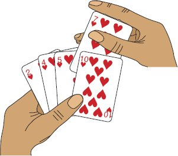
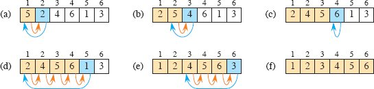
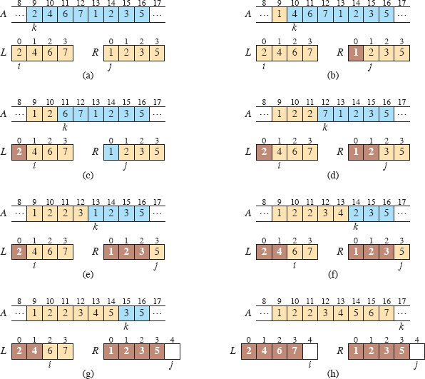
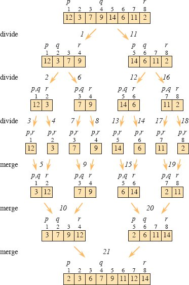
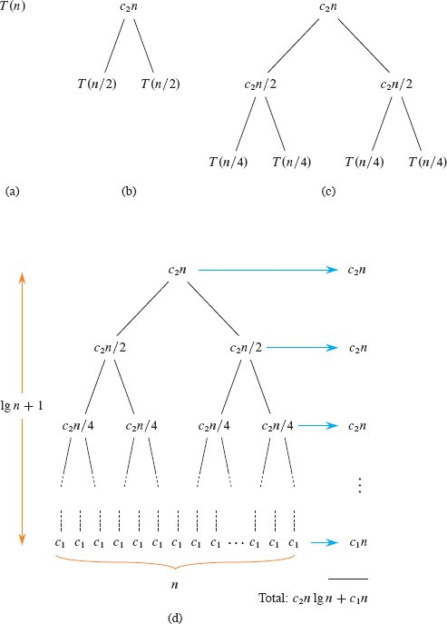

# 入门

本章将使你熟悉我们将在整本书中使用的框架来思考算法的设计和分析。 它是独立的，但确实包含了对将在第 3 章和第 4 章中介绍的材料的一些参考。（它还包含一些求和，附录 A 显示了如何求解。）
我们将从检查插入排序算法开始，以解决第 1 章中介绍的排序问题。我们将使用伪代码指定算法，如果你进行过计算机编程，你应该可以理解。 我们将了解为什么插入排序能够正确排序并分析其运行时间。 该分析引入了一种符号，该符号描述了运行时间如何随着要排序的项目数量的增加而增加。 在讨论插入排序之后，我们将使用一种称为分而治之的方法来开发一种称为归并排序的排序算法。 我们将以分析归并排序的运行时间作为结尾。

## 2.1 插入排序

我们的第一个算法，插入排序，解决了第 1 章介绍的排序问题：
输入：n 个数字的序列 <a~1~, a~2~, … , a~n~>。

输出：输入序列的排列（重新排序）$(a_{1}^{'},\ a_{2}^{'},\dots ,a_{n}^{'})$使得 $a_{1}^{'} \le a_{2}^{'}\le\dots \le a_{n}^{'}$。

要排序的数字也称为键。 尽管问题在概念上是关于对序列进行排序的，但输入是以具有 n 个元素的数组的形式出现的。 当我们要对数字进行排序时，通常是因为它们是与其他数据相关联的键，我们称之为卫星数据。 密钥和卫星数据一起形成记录。 例如，考虑一个包含学生记录的电子表格，其中包含许多相关数据，例如年龄、平均绩点和所修课程的数量。 这些数量中的任何一个都可以是一个键，但是当电子表格排序时，它会移动与键相关的记录（卫星数据）。 在描述排序算法时，我们关注键，但重要的是要记住通常有相关的卫星数据。
在本书中，我们通常将算法描述为用伪代码编写的过程，在许多方面类似于 C、C++、Java、Python^1^ 或 JavaScript。 （如果我们遗漏了你最喜欢的编程语言，我们深表歉意。我们无法一一列举。）如果你接触过这些语言中的任何一种，你应该可以轻松理解用伪代码"编码"的算法。 伪代码与真实代码的区别在于，在伪代码中，我们使用最清晰简洁的表达方法来指定给定的算法。 有时最清晰的方法是英文，所以如果你在看起来更像真实代码的部分中看到嵌入的英文短语或句子，请不要感到惊讶。 伪代码和真实代码之间的另一个区别是，伪代码通常会忽略软件工程的各个方面——例如数据抽象、模块化和错误处理——以便更简洁地传达算法的本质。
我们从插入排序开始，这是一种对少量元素进行排序的高效算法。 插入排序的工作方式与你可能对一手扑克牌进行排序的方式相同。 从空着的左手开始，牌堆在桌子上。 拿起牌堆中的第一张牌并用左手握住它。 然后，用右手从牌堆中一次取出一张牌，然后将其插入左手的正确位置。 如图 2.1 所示，你可以通过将一张牌与你左手已有的每张牌进行比较，从右手开始向左移动，从而找到一张牌的正确位置。 一旦你看到左手的一张牌的价值小于或等于你右手拿着的牌，就把你右手拿着的牌插入这张牌的右边 你的左手。 如果你左手所有牌的点数都大于你右手牌，则将这张牌放在你左手最左边的牌上。 一直以来，你左手拿着的牌都是经过排序的，这些牌本来就是桌上那堆最上面的牌。
插入排序的伪代码在对页中作为过程 INSERTION-SORT 给出。 它有两个参数：一个包含要排序的值的数组 A 和排序值的数量 n。 这些值占据数组的位置 A[1] 到 A[n]，我们用 A[1: n] 表示。 当 INSERTION-SORT 过程完成时，数组 A[1 : n] 包含原始值，但按排序顺序排列。



图 2.1 使用插入排序对一手牌进行排序。

```
INSERTION-SORT(A, n)
for i = 2 to n
    key = A[i]
    // Insert A[i] into the sorted subarray A[1 : i – 1].
    j = i – 1
    while j > 0 and A[j] > key
        A[j + 1] = A[j]
        j = j – 1
    A[j + 1] = key
```

循环不变量和插入排序的正确性

图 2.2 显示了该算法如何适用于以序列 <5, 2, 4, 6, 1, 3> 开始的数组 A。 索引 i 表示插入手中的"当前卡"。 在由 i 索引的 for 循环的每次迭代开始时，子数组（数组的连续部分）由元素 A[1 : i – 1]（即 A[1] 到 A[i – 1]) 构成了当前排序的手牌，剩余的子数组 A[i + 1 : n]（元素 A[i + 1] 到 A[n]）对应于仍在桌上的那堆牌。 事实上，元素 A[1 : i – 1] 是最初位于位置 1 到 i – 1 的元素，但现在已排序。 我们将 A[1 : i – 1] 的这些属性形式化地表述为循环不变量：



图 2.2 INSERTION-SORT(A, n) 的操作，其中 A 初始包含序列 <5, 2, 4, 6, 1, 3> 且 n = 6。数组索引出现在矩形上方，值存储在 阵列位置出现在矩形内。 (a)–(e) 第 1–8 行 for 循环的迭代。 在每次迭代中，蓝色矩形包含取自 A[i] 的键，在第 5 行的测试中将其与左侧棕褐色矩形中的值进行比较。橙色箭头显示数组值在第 6 行中向右移动了一个位置 , 和蓝色箭头表示键在第 8 行移动到的位置。 (f) 最终排序的数组。

> 在第 1–8 行的 for 循环的每次迭代开始时，子数组 A[1 : i – 1] 包含最初在 A[1 : i – 1] 中的元素，但按排序顺序排列。

循环不变量帮助我们理解为什么算法是正确的。 当你使用循环不变量时，你需要展示三件事：

- **初始化**：在循环的第一次迭代之前为真。
- **维护**：如果在循环的一次迭代之前为真，则在下一次迭代之前它仍然为真。
- **终止**：循环终止，当它终止时，不变量（通常连同循环终止的原因）为我们提供了一个有用的属性，有助于证明算法是正确的。

当前两个属性成立时，循环不变量在循环的每次迭代之前都为真。 （当然，除了循环不变量本身之外，你可以自由使用既定事实来证明循环不变量在每次迭代之前仍然为真。）循环不变证明是数学归纳法的一种形式，用于证明一个属性成立， 你证明了一个基本案例和一个归纳步骤。 这里，显示在第一次迭代之前不变量成立对应于基本情况，显示不变量从迭代到迭代都成立对应于归纳步骤。
第三个属性可能是最重要的一个，因为你正在使用循环不变量来显示正确性。 通常，你使用循环不变量以及导致循环终止的条件。 数学归纳法通常无限地应用归纳步骤，但在循环不变量中，"归纳法"在循环终止时停止。
让我们看看这些属性如何适用于插入排序。
**初始化**：我们首先证明循环不变量在第一次循环迭代之前成立，当 i = 2.2 子数组 A[1 : i – 1] 仅由单个元素 A[1] 组成，实际上它是中的原始元素 一个[1]。 此外，此子数组已排序（毕竟，只有一个值的子数组怎么可能不排序？），这表明循环不变量在循环的第一次迭代之前成立。

**维护**：接下来，我们处理第二个属性：表明每次迭代都保持循环不变。 非正式地，for 循环的主体通过将 A[i – 1]、A[i – 2]、A[i – 3] 等中的值向右移动一个位置，直到找到正确的位置 对于 A[i]（第 4-7 行），此时它插入 A[i] 的值（第 8 行）。 子数组 A[1 : i] 然后由最初在 A[1 : i] 中的元素组成，但按排序顺序排列。 为 for 循环的下一次迭代增加 i（将其值增加 1）然后保留循环不变性。

对第二个属性的更正式的处理将要求我们声明并显示第 5-7 行的 while 循环的循环不变量。 让我们暂时不要陷入这种形式主义的泥潭。 相反，我们将依靠我们的非正式分析来证明第二个属性适用于外循环。
**终止**：最后，我们检查循环终止。 循环变量 i 从 2 开始，并在每次迭代中增加 1。 一旦 i 的值超过第 1 行中的 n，循环就会终止。 也就是说，一旦 i 等于 n + 1，循环就终止。在循环不变量的措辞中用 n + 1 代替 i 会得出子数组 A[1 : n] 由 A[1 : n] 中的元素组成，但是 按排序顺序。 因此，该算法是正确的。

这种循环不变量的方法在本书的不同地方被用来证明正确性。

### 伪代码约定

我们在伪代码中使用以下约定。

- 缩进表示块结构。 例如，从第 1 行开始的 for 循环体包含第 2-8 行，而从第 5 行开始的 while 循环体包含第 6-7 行但不包含第 8 行。我们的缩进样式适用于 if- else statements3 也是如此。 使用缩进代替块结构的文本指示符，例如开始和结束语句或大括号，可以减少混乱，同时保持甚至增强清晰度。 ^4^
- 循环结构 while、for 和 repeat-until 以及 if-else 条件结构的解释与 C、C++、Java、Python 和 JavaScript 中的类似。^5^ 在本书中，循环计数器在循环结束后保持其值 exited，这与 C++ 和 Java 中出现的某些情况不同。 因此，在 for 循环之后，循环计数器的值是第一个超过 for 循环边界的值。^6^ 我们在插入排序的正确性参数中使用了这个属性。 第 1 行中的 for 循环标题是 for i = 2 to n，因此当此循环终止时，i 等于 n + 1。当 for 循环在每次迭代中递增其循环计数器时，我们使用关键字 to，我们使用关键字 downto 当 for 循环递减其循环计数器时（在每次迭代中将其值减 1）。 当循环计数器的变化量大于 1 时，变化量跟在可选关键字 by 之后。
- 符号"//"表示该行的其余部分是注释。
- 变量（例如 i、j 和 key）是给定过程的局部变量。 没有明确指示，我们不会使用全局变量。
- 我们通过指定数组名称后跟方括号中的索引来访问数组元素。 例如，A[i] 表示数组 A 的第 i 个元素。
  尽管许多编程语言都强制对数组进行 0 原点索引（0 是最小的有效索引），但我们选择了人类读者最容易理解的索引方案。 因为人们通常从 1 而不是 0 开始计数，所以本书中的大多数（但不是全部）数组都使用从 1 开始的索引。 为了弄清楚特定算法是采用 0 原点索引还是 1 原点索引，我们将明确指定数组的边界。 如果你正在实施我们指定使用 1 源索引的算法，但你正在使用强制执行 0 源索引的编程语言（例如 C、C++、Java、Python 或 JavaScript）编写，那么请相信自己 能够调整。 你可以始终从每个索引中减去 1，或者为每个数组分配一个额外的位置而忽略位置 0。
  符号"："表示子数组。 因此，A[i : j] 表示由元素 A[i]、A[i + 1]、...、A[j] 组成的 A 的子数组。^7^ 我们也使用这种表示法来表示数组的边界， 正如我们之前讨论数组 A[1 : n] 时所做的那样。
- 我们通常将复合数据组织成由属性组成的对象。 我们使用许多面向对象编程语言中的语法来访问特定属性：对象名称后跟一个点，然后是属性名称。 例如，如果对象 x 具有属性 f，我们将此属性表示为 x.f。
  我们将表示数组或对象的变量视为指向表示数组或对象的数据的指针（在某些编程语言中称为引用）。 对于对象 x 的所有属性 f，设置 y = x 会导致 y.f 等于 x.f。 此外，如果我们现在设置 x.f = 3，那么之后不仅 x.f 等于 3，而且 y.f 也等于 3。 也就是说，赋值y=x后x和y指向同一个对象。 这种处理数组和对象的方式与大多数当代编程语言一致。
  我们的属性符号可以"级联"。 例如，假设属性 f 本身是指向具有属性 g 的某种类型对象的指针。 然后符号 x.f.g 被隐式括为 (x.f).g。 换句话说，如果我们指定 y = x.f，则 x.f.g 与 y.g 相同。
  有时指针根本不指向任何对象。 在这种情况下，我们赋予它特殊值 NIL。
- 我们按值将参数传递给过程：被调用过程接收它自己的参数副本，如果它为参数赋值，则调用过程看不到更改。 传递对象时，会复制指向表示对象的数据的指针，但不会复制对象的属性。 例如，如果 x 是被调用过程的参数，则被调用过程中的赋值 x = y 对调用过程不可见。 但是，如果调用过程具有指向与 x 相同的对象的指针，则赋值 x.f = 3 是可见的。 类似地，数组通过指针传递，因此传递的是指向数组的指针，而不是整个数组，并且调用过程可以看到对单个数组元素的更改。 同样，大多数现代编程语言都是这样工作的。
- return 语句立即将控制权转移回调用过程中的调用点。 大多数 return 语句还采用一个值传递回调用者。 我们的伪代码不同于许多编程语言，因为我们允许在单个返回语句中返回多个值，而无需创建对象将它们打包在一起。 ^8^
- 布尔运算符"and"和"or"是短路的。 也就是说，通过首先评估 x 来评估表达式"x 和 y"。 如果 x 的计算结果为 FALSE，则整个表达式不能计算为 TRUE，因此不会计算 y。 另一方面，如果 x 的计算结果为 TRUE，则必须计算 y 以确定整个表达式的值。 类似地，在表达式"x or y"中，仅当 x 的计算结果为 FALSE 时，表达式 y 才会被计算。 短路运算符允许我们编写布尔表达式，例如"x ≠ NIL 和 x.f = y"，而不必担心当 x 为 NIL 时计算 x.f 时会发生什么。
- 关键字 error 表示由于调用过程的条件错误而发生错误，并且该过程立即终止。 调用过程负责处理错误，因此我们不指定要采取什么操作。

### 练习

**2.1-1** 使用图 2.2 作为模型，说明 INSERTION-SORT 对最初包含序列 <31, 41, 59, 26, 41, 58> 的数组的操作。
**2.1-2** 考虑对页上的过程 SUM-ARRAY。 它计算数组 A[1 : n] 中 n 个数字的总和。 声明此过程的循环不变量，并使用其初始化、维护和终止属性来表明 SUM-ARRAY 过程返回 A[1 : n] 中数字的总和。

```
SUM-ARRAY(A, n)
sum = 0
for i = 1 to n
    sum = sum + A[i]
return sum
```

**2.1-3** 重写 INSERTION-SORT 过程以排序为单调递减顺序而不是单调递增顺序。
**2.1-4** 考虑搜索问题：
输入：存储在数组 A[1 : n] 中的 n 个数 <a~1~, a~2~, … , a~n~> 和一个值 x 的序列。

输出：一个索引 i 使得 x 等于 A[i] 或特殊值 NIL 如果 x 没有出现在 A 中。

为线性搜索编写伪代码，它从头到尾扫描数组，寻找 x。 使用循环不变量，证明你的算法是正确的。 确保你的循环不变量满足三个必要的属性。

**2.1-5** 考虑将两个 n 位二进制整数 a 和 b 相加的问题，它们存储在两个 n 元素数组 A[0 : n – 1] 和 B[0 : n – 1] 中，其中每个元素要么是 0 要么是 1, $a = {\textstyle \sum_{i=0}^{n-1}}A[i]\cdot 2^{i} $, 和 $b = {\textstyle \sum_{i=0}^{n-1}}B[i]\cdot 2^{i} $。 两个整数的和 c = a + b 应以二进制形式存储在 (n + 1) 元素数组 C [0 : n] 中，其中 $c = {\textstyle \sum_{i=0}^{n-1}}C[i]\cdot 2^{i} $. 编写一个 ADD-BINARY-INTEGERS 过程，它将数组 A 和 B 以及长度 n 作为输入，并返回包含总和的数组 C。

## 2.2 分析算法

分析算法意味着预测算法所需的资源。 你可能会考虑内存、通信带宽或能源消耗等资源。 然而，大多数情况下，你会想要测量计算时间。 如果针对一个问题分析多个候选算法，你可以找出最有效的一个。 可能不止一个可行的候选者，但你通常可以在此过程中排除几种劣质算法。
在分析算法之前，你需要一个运行该算法的技术模型，包括该技术的资源和表达其成本的方式。 本书的大部分内容假定通用的单处理器、随机存取机 (RAM) 计算模型作为实现技术，并理解算法是作为计算机程序实现的。 在 RAM 模型中，指令一条接一条地执行，没有并发操作。 RAM 模型假设每条指令花费的时间与任何其他指令相同，并且每次数据访问（使用变量的值或存储到变量中）花费的时间与任何其他数据访问相同。 换句话说，在 RAM 模型中，每条指令或数据访问都需要一定的时间——即使是索引到数组中也是如此。 ^9^
严格来说，我们应该精确定义RAM模型的指令及其成本。 然而，这样做会很乏味，而且对算法设计和分析的洞察力很小。 然而，我们必须小心不要滥用 RAM 模型。 例如，如果 RAM 有一条排序指令怎么办？ 然后你可以一步排序。 这样的 RAM 是不现实的，因为这样的指令不会出现在真实的计算机中。 因此，我们的指南是真正的计算机是如何设计的。 RAM 模型包含真实计算机中常见的指令：算术（例如加、减、乘、除、余数、floor、ceiling）、数据移动（加载、存储、复制）和控制（条件和无条件分支、子程序调用） 并返回）。
RAM 模型中的数据类型是整数、浮点数（用于存储实数近似值）和字符。 真实计算机通常没有单独的布尔值 TRUE 和 FALSE 数据类型。 相反，他们经常测试一个整数值是 0 (FALSE) 还是非零 (TRUE)，就像在 C 中一样。虽然我们通常不关心本书中浮点值的精度（许多数字不能用 floating 精确表示 点），精度对于大多数应用程序至关重要。 我们还假设每个数据字都有位数限制。 例如，当处理大小为 n 的输入时，我们通常假设整数由 c log~2~ n 位表示，其中某个常数 c ≥ 1。我们需要 c ≥ 1，以便每个词都可以保存 n 的值，从而使我们能够索引 单个输入元素，我们将 c 限制为一个常数，以便单词大小不会任意增长。 （如果字的大小可以任意增长，我们可以在一个字中存储大量数据并在恒定时间内对所有数据进行操作——这是一种不切实际的场景。）
真实计算机包含上面未列出的指令，这些指令代表 RAM 模型中的灰色区域。 例如，求幂是常数时间指令吗？ 在一般情况下，不：当 x 和 n 是一般整数时计算 xn 通常需要 n 的对数时间（参见第 934 页的等式 (31.34)），并且你必须担心结果是否适合计算机字。 但是，如果 n 是 2 的精确幂，则求幂通常可以视为常数时间运算。 许多计算机都有一个"左移"指令，它在常数时间内将整数的位向左移动 n 个位置。 在大多数计算机中，将整数的位左移 1 位相当于乘以 2，因此将位左移 n 位相当于乘以 2^n^。 因此，此类计算机可以通过将整数 1 向左移动 n 个位置来在 1 个恒定时间指令中计算 2^n^，只要 n 不超过计算机字中的位数。 我们将尽量避免 RAM 模型中的此类灰色区域，并在结果小到足以用计算机字表示时将计算 2^n^ 和乘以 2^n^ 视为常数时间操作。
RAM 模型不考虑现代计算机中常见的内存层次结构。 它既不模拟缓存也不模拟虚拟内存。 其他几种计算模型试图解释内存层次效应，这有时在真实机器上的真实程序中很重要。 第 11.5 节和本书中的一些问题检查了内存层次结构的影响，但在大多数情况下，本书中的分析没有考虑它们。 包含内存层次结构的模型比 RAM 模型复杂得多，因此很难使用。 此外，RAM 模型分析通常可以很好地预测实际机器的性能。
虽然在 RAM 模型中分析算法通常很简单，但有时这可能是一个相当大的挑战。 你可能需要使用数学工具，例如组合学、概率论、代数技巧以及识别公式中最重要项的能力。 因为一个算法对于每个可能的输入可能会有不同的行为，我们需要一种方法来用简单易懂的公式来总结这种行为。

### 插入排序分析

INSERTION-SORT 过程需要多长时间？ 一种判断方法是让你在计算机上运行它并计算运行时间。 当然，你首先必须用真正的编程语言来实现它，因为你不能直接运行我们的伪代码。 这样的计时测试会告诉你什么？ 你会发现插入排序在你的特定计算机、特定输入、你创建的特定实现、你运行的特定编译器或解释器、你链接的特定库以及与 在你的计算机上与计时测试同时运行的特定后台任务（例如检查通过网络传入的信息）。 如果你在计算机上使用相同的输入再次运行插入排序，你甚至可能会得到不同的计时结果。 从仅在一台计算机和一个输入上运行插入排序的一个实现，如果你要给它一个不同的输入，如果你要在另一台计算机上运行它，你将能够确定插入排序的运行时间 ，或者如果你要用不同的编程语言来实现它？ 不多。 我们需要一种方法来预测，给定一个新输入，插入排序需要多长时间。
我们可以通过分析算法本身来确定插入排序需要多长时间，而不是计算一次或什至多次运行的时间。 我们将检查它执行每行伪代码的次数以及每行伪代码运行的时间。 我们将首先为运行时间提出一个精确但复杂的公式。 然后，我们将使用一种方便的符号来提炼公式的重要部分，这可以帮助我们比较针对同一问题的不同算法的运行时间。
我们如何分析插入排序？ 首先，让我们承认运行时间取决于输入。 对 1000 个数字进行排序比对三个数字进行排序需要更长的时间，这并不奇怪。 此外，插入排序可能需要不同的时间来对两个相同大小的输入数组进行排序，具体取决于它们已经排序的程度。 尽管运行时间可能取决于输入的许多特征，但我们将关注已被证明具有最大影响的特征，即输入的大小，并将程序的运行时间描述为函数 其输入的大小。 为此，我们需要更仔细地定义术语"运行时间"和"输入大小"。 我们还需要弄清楚我们是在讨论引发最坏情况行为、最佳情况行为还是其他情况的输入的运行时间。
输入大小的最佳概念取决于所研究的问题。 对于许多问题，例如排序或计算离散傅里叶变换，最自然的度量是输入中的项目数——例如，被排序的项目数 n。 对于许多其他问题，例如两个整数相乘，输入大小的最佳度量是用普通二进制表示法表示输入所需的总位数。 有时用不止一个数字来描述输入的大小更合适。 例如，如果算法的输入是图，我们通常用图中的顶点数和边数来表征输入大小。 我们将指出我们研究的每个问题正在使用哪种输入大小度量。
算法在特定输入上的运行时间是执行的指令和数据访问的数量。 我们如何计算这些成本应该独立于任何特定的计算机，但在 RAM 模型的框架内。 现在，让我们采纳以下观点。 执行伪代码的每一行都需要固定的时间。 一行可能比另一行花费更多或更少的时间，但我们假设第 k 行的每次执行都花费 ck 时间，其中 ck 是一个常数。 这个观点与 RAM 模型一致，它也反映了伪代码将如何在大多数实际计算机上实现。 ^10^
让我们分析一下 INSERTION-SORT 过程。 正如承诺的那样，我们将首先设计一个使用输入大小和所有语句成本 ck 的精确公式。 然而，这个公式被证明是混乱的。 然后，我们将切换到更简洁、更易于使用的更简单的表示法。 这种更简单的表示法清楚地说明了如何比较算法的运行时间，尤其是在输入量增加的情况下。
为了分析INSERTION-SORT过程，让我们在下页查看每条语句的时间成本和每条语句的执行次数。 对于每个 i = 2, 3, … , n，令 ti 表示第 5 行中的 while 循环测试针对该 i 值执行的次数。 当 for 或 while 循环以通常的方式退出时——因为循环头中的测试出现 FALSE——测试比循环体多执行一次。 因为注释不是可执行语句，所以假设它们不需要时间。
算法的运行时间是每条语句执行的运行时间之和。 执行 ck 个步骤并执行 m 次的语句占总运行时间的 ckm。^11^ 我们通常用 T (n) 表示算法在大小为 n 的输入上的运行时间。 为了计算 T (n)，INSERTION-SORT 在 n 个值的输入上的运行时间，我们将成本和时间列的乘积相加，得到

```python
INSERTION-SORT(A, n)                                        # cost times

for i = 2 to n                                              # c~1~   n
    key = A[i]                                              # c~2~   n – 1
    // Insert A[i] into the sorted subarray A[1 : i – 1].   # 0      n – 1
    j = i – 1                                               # c4     n – 1
    while j > 0 and A[j] > key                              # c5
        A[j + 1] = A[j]                                     # c6
        j = j – 1                                           # c7
        A[j + 1] = key                                      # c8     n – 1
```

$$
T(n) = c_{1}n + c_{2}(n-1) + c_{4}(n-1) + c_{5}\sum_{i=2}^{n}t_{i} + c_{6}\sum_{i=2}^{n}(t_{i} - 1) +  c_{7}\sum_{i=2}^{n}(t_{i} - 1) + c_{8}(n-1)
$$

即使对于给定大小的输入，算法的运行时间也可能取决于给定该大小的输入。 例如，在 INSERTION-SORT 中，最好的情况发生在数组已经排序时。 在这种情况下，每次执行第 5 行时，key 的值（A[i] 中的原始值）已经大于或等于 A[1 : i – 1] 中的所有值，因此 while 循环 第 5–7 行总是在第 5 行的第一次测试时退出。因此，我们有 t~i~ = 1 for i = 2, 3, … , n，最佳情况下的运行时间由下式给出
$$
T(n) = c_{1}n + c_{2}(n-1) + c_{4}(n-1) + c_{5}(n-1) + c_{8}(n-1) = (c_{1} + c_{2} + c_{4}+c_{5}+c_{8})n - (c_{2} + c_{4}+ c_{5}+c_{8})
$$
对于依赖于语句成本 c~k~ 的常量 a 和 b，我们可以将此运行时间表示为 an + b（其中 a = c~1~ + c~2~ + c~4~ + c~5~ + c~8~ 和 b = c~2~ + c~4~ + c~5~ + c~8~）。 因此，运行时间是 n 的线性函数。
最坏的情况出现在数组倒序排列时——也就是说，它以降序排列。 该过程必须将每个元素 A[i] 与整个已排序子数组 A[1 : i – 1] 中的每个元素进行比较，因此 t~i~ = i for i = 2, 3, … , n。 （该过程在第 5 行发现每次 A[j] > key，只有当 j 达到 0 时 while 循环才退出。）注意到
$$
\sum_{i=2}^{n} i = \left ( \sum_{i=1}^{n}i  \right )-1 = \frac{n(n+1)}{2} - 1
$$
和
$$
\sum_{i=2}^{n} (i-1) = \left ( \sum_{i=1}^{n-1}i  \right )-1 = \frac{n(n-1)}{2} 
$$
我们发现在最坏的情况下，INSERTION-SORT 的运行时间是
$$
T(n)=c_{1}n+c_{2}(n-1)+c_{4}(n-1)+c_{5}(\frac{n(n+1)}{2}-1)+c_{6}(\frac{n(n-1)}{2})+c_{7}(\frac{n(n-1)}{2})+c_{8}(n-1)=
(\frac{c_{5}}{2}+\frac{c_{6}}{2}+\frac{c_{7}}{2})+(c_{1}+c_{2}+c_{4}+\frac{c_{5}}{2}-\frac{c_{6}}{2}-\frac{c_{7}}{2}+c_{8})n-(c_{2}+c_{4}+c_{5}+c_{8})
$$
对于常量 a、b 和 c，我们可以将最坏情况下的运行时间表示为 an^2^ + bn + c，这再次取决于语句成本 c~k~（现在，a = c~5~/2 + c~6~/2 + c~7~/2，b = c~1~ + c~2~ + c~4~ + c~5~/2 – c~6~/2 – c~7~/2 + c~8~，和 c = –(c~2~ + c~4~ + c~5~ + c~8~))。 因此，运行时间是 n 的二次函数。
通常，与插入排序一样，对于给定的输入，算法的运行时间是固定的，但我们也会看到一些有趣的"随机化"算法，即使输入固定，其行为也会发生变化。

### 最坏情况和平均情况分析

我们对插入排序的分析同时考虑了最好的情况，即输入数组已经排序，以及最坏的情况，即输入数组被反向排序。 不过，对于本书的其余部分，我们通常（但并非总是）专注于寻找最坏情况下的运行时间，即对于任何大小为 n 的输入的最长运行时间。 为什么？ 以下是三个原因：

- 算法的最坏情况运行时间给出了任何输入的运行时间上限。 如果你知道它，那么你就可以保证算法永远不会花费更长的时间。 你无需对运行时间做出有根据的猜测并希望它永远不会变得更糟。 此功能对于实时计算尤其重要，其中操作必须在截止日期前完成。
- 对于某些算法，最坏的情况经常发生。 例如，在数据库中搜索特定信息时，搜索算法的最坏情况通常发生在数据库中不存在该信息时。 在某些应用程序中，可能会频繁搜索缺失信息。
- "平均情况"通常与最坏情况大致一样糟糕。 假设你对包含 n 个随机选择的数字的数组运行插入排序。 需要多长时间才能确定在子数组 A[1 : i – 1] 中的哪个位置插入元素 A[i]？ 平均而言，A[1 : i – 1] 中一半的元素小于 A[i]，一半的元素大于 A[i]。 因此，平均而言，A[i] 仅与子数组 A[1 : i – 1] 的一半进行比较，因此 ti 约为 i/2。 结果平均情况下的运行时间是输入大小的二次函数，就像最坏情况下的运行时间一样。

在某些特定情况下，我们会对算法的平均情况运行时间感兴趣。 我们将在本书中看到应用于各种算法的概率分析技术。 平均案例分析的范围是有限的，因为对于特定问题，什么构成"平均"输入可能并不明显。 通常，我们会假设给定大小的所有输入都有相同的可能性。 在实践中，这个假设可能会被违反，但我们有时可以使用随机算法，它会做出随机选择，以允许进行概率分析并产生预期的运行时间。 我们将在第 5 章和其他几章中更多地探讨随机算法。

### 排序增长

为了简化我们对 INSERTION-SORT 过程的分析，我们使用了一些简化的抽象。 首先，我们忽略了每条语句的实际成本，使用常数 c~k~ 来表示这些成本。 尽管如此，方程式 (2.1) 和 (2.2) 中的最佳情况和最坏情况运行时间仍然相当笨拙。 这些表达式中的常量给了我们比我们真正需要的更多的细节。 这就是为什么我们还将最佳情况下的运行时间表示为 an + b（取决于语句成本 ck 的常量 a 和 b）以及为什么我们将最坏情况下的运行时间表示为 an^2^ + bn + c（对于常量 a、b 和 c 取决于报表成本。 因此，我们不仅忽略了实际陈述成本，还忽略了抽象成本 c~k~。
现在让我们做一个更简单的抽象：我们真正感兴趣的是运行时间的增长率或增长顺序。 因此，我们只考虑公式的首项（例如 an^2^），因为对于较大的 n 值，低阶项相对无关紧要。 我们还忽略了前导项的常数系数，因为常数因子在确定大输入的计算效率方面不如增长率重要。 对于插入排序的最坏情况运行时间，当我们忽略低阶项和前项的常数系数时，只剩下前项的因子 n^2^。 该因素 n^2^ 是迄今为止运行时间中最重要的部分。 例如，假设在特定机器上实现的算法在大小为 n 的输入上花费 n^2^/100 + 100n + 17 微秒。 尽管 n^2^ 项的 1/100 和 n 项的 100 的系数相差四个数量级，但一旦 n 超过 10,000，n^2^/100 项将主导 100n 项。 10,000 人虽然看起来很多，但比一般城镇的人口还要少。 许多现实世界的问题都有更大的输入大小。
为了突出运行时间的增长顺序，我们有一个使用希腊字母 Θ (theta) 的特殊符号。 我们写道，插入排序的最坏情况运行时间为 Θ(n^2^)（发音为"theta of n-squared"或简称为"theta n-squared"）。 我们还写道，插入排序的最佳运行时间为 Θ(n)（"theta of n"或"theta n"）。 现在，将 Θ 符号视为"当 n 很大时大致成比例"，因此 Θ(n^2^) 表示"当 n 很大时大致与 n^2^ 成比例"，而 Θ(n) 表示"当 n 大时大致与 n 成比例" large" 我们将在本章中非正式地使用 Θ 符号，并在第 3 章中对其进行精确定义。
我们通常认为一种算法比另一种算法更有效，前提是其最坏情况运行时间的增长阶数较低。 由于常数因子和低阶项，运行时间具有较高阶增长的算法可能比运行时间具有较低阶增长的算法花费更少的时间来处理小输入。 但是在足够大的输入下，例如，最坏情况运行时间为 Θ(n^2^) 的算法在最坏情况下比最坏情况运行时间为 Θ(n^3^) 的算法花费的时间更少。 不管 Θ 符号隐藏的常数如何，总有一些数字，比如 n^0^，使得对于所有输入大小 n ≥ n^0^，Θ(n^2^) 算法在最坏的情况下击败 Θ(n^3^) 算法。

### 练习

**2.2-1** 用 Θ 表示法表示函数 n^3^/1000 + 100n^2^ – 100n + 3。
**2.2-2** 考虑对存储在数组 A[1 : n] 中的 n 个数字进行排序，首先找到 A[1 : n] 的最小元素并将其与 A[1] 中的元素交换。 然后找到A[2 : n]中的最小元素，与A[2]交换。 然后找到A[3 : n]中的最小元素，与A[3]交换。 继续以这种方式处理 A 的前 n-1 个元素。为该算法编写伪代码，该算法称为选择排序。 该算法保持什么循环不变性？ 为什么它只需要对前 n-1 个元素运行，而不是对所有 n 个元素运行？ 以 Θ 符号给出选择排序的最坏情况运行时间。 最好情况下的运行时间是否更好？
**2.2-3** 再次考虑线性搜索（参见练习 2.1-4）。 假设要搜索的元素与数组中的任何元素的可能性相同，平均需要检查输入数组中的多少个元素？ 最坏的情况下怎么办？ 使用 Θ 符号，给出线性搜索的平均情况和最坏情况运行时间。 证明你的答案。
**2.2-4** 你如何修改任何排序算法以获得良好的最佳运行时间？

## 2.3 设计算法

你可以从范围广泛的算法设计技术中进行选择。 插入排序采用增量法：对每个元素A[i]，将其插入子数组A[1:i]中的适当位置，子数组A[1:i-1]已经排好序。
本节研究另一种设计方法，称为"分而治之"，我们将在第 4 章中更详细地探讨它。我们将使用分而治之来设计一种排序算法，其最坏情况下的运行时间要少得多 不如插入排序。 使用遵循分而治之法的算法的一个优点是分析其运行时间通常很简单，使用我们将在第 4 章中探讨的技术。

### 2.3.1 分而治之的方法

许多有用的算法在结构上都是递归的：为了解决给定的问题，它们递归（调用自己）一次或多次以处理密切相关的子问题。 这些算法通常遵循分而治之的方法：它们将问题分解为几个与原始问题相似但规模更小的子问题，递归地解决子问题，然后组合这些解决方案来创建原始问题的解决方案。
在分而治之的方法中，如果问题足够小（基本情况），你只需直接解决它而无需递归。 否则——递归情况——你执行三个特征步骤：

- 将问题分成一个或多个子问题，这些子问题是同一问题的较小实例。
- 通过递归解决子问题来征服它们。
- 组合子问题的解决方案以形成原始问题的解决方案。

归并排序算法紧跟分治法。 在每一步中，它都会对子数组 A[p : r] 进行排序，从整个数组 A[1 : n] 开始，递归到越来越小的子数组。 以下是归并排序的运作方式：

- 将待排序的子数组 A[p : r] 分成两个相邻的子数组，每个子数组的大小减半。 为此，计算 A[p : r] 的中点 q（取 p 和 r 的平均值），并将 A[p : r] 划分为子数组 A[p : q] 和 A[q + 1 : r] .
- 通过使用归并排序对两个子数组 A[p : q] 和 A[q + 1 : r] 中的每一个进行递归排序来解决。
- 通过将两个排序的子数组 A[p : q] 和 A[q + 1 : r] 合并回 A[p : r] 来组合，产生排序的答案。

当要排序的子数组 A[p : r] 只有 1 个元素时，即当 p 等于 r 时，递归"触底"——它到达最小情况。 正如我们在 INSERTION-SORT 的循环不变量的初始化参数中所指出的，仅包含单个元素的子数组总是排序的。
归并排序算法的关键操作发生在"合并"步骤，合并两个相邻的、已排序的子数组。 合并操作由下一页的辅助过程 MERGE(A, p, q, r) 执行，其中 A 是数组，p、q 和 r 是数组的索引，使得 p ≤ q < r。 该过程假定相邻子数组 A[p : q] 和 A[q + 1 : r] 已经递归排序。 它合并两个已排序的子数组以形成一个单独的已排序子数组来替换当前子数组 A[p : r]。
为了理解 MERGE 过程是如何工作的，让我们回到我们的纸牌游戏主题。 假设你在桌子上有两叠纸牌，面朝上。 每堆牌都经过排序，最小的牌在最上面。 你希望将这两堆合并成一个已排序的输出堆，该堆将面朝下放在桌子上。 基本步骤包括选择两张牌中较小的一张放在面朝上的牌堆顶部，将其从牌堆中取出——露出一张新的顶牌——然后将这张牌面朝下放在输出牌堆上。 重复此步骤，直到一个输入堆为空，此时你可以取出剩余的输入堆并将整堆翻转过来，将其面朝下放在输出堆上。
让我们考虑一下合并两堆已排序的卡片需要多长时间。 每个基本步骤都需要恒定的时间，因为你只是在比较最上面的两张牌。 如果你开始的两个排序的堆中每个都有 n/2 张牌，那么基本步骤的数量至少为 n/2（因为无论哪个堆被清空，每张牌都被发现小于另一堆中的一些牌 ) 和至多 n（实际上，至多 n – 1，因为在 n – 1 个基本步骤之后，其中一堆必须是空的）。 每个基本步骤花费常数时间并且基本步骤的总数在 n/2 和 n 之间，我们可以说合并花费的时间大致与 n 成正比。 也就是说，合并需要 Θ(n) 的时间。
详细来说，MERGE 过程的工作原理如下。 它将两个子数组 A[p : q] 和 A[q + 1 : r] 复制到临时数组 L 和 R（"左"和"右"）中，然后将 L 和 R 中的值合并回 A[ p：r]。 第 1 行和第 2 行分别计算子数组 A[p : q] 和 A[q + 1 : r] 的长度 n~L~ 和 n~R~。 然后第 3 行创建数组 L[0 : n~L~ – 1] 和 R[0 : n~R~ – 1]，长度分别为 n~L~ 和 n~R~。^12^ 第 4–5 行的 for 循环将子数组 A[p : q] 复制到 L， 第 6–7 行的 for 循环将子数组 A[q + 1 : r] 复制到 R 中。

```python
MERGE(A, p, q, r)
nL = q – p + 1                                      # length of A[p : q]
nR = r – q                                          # length of A[q + 1 : r]
let L[0 : nL – 1] and R[0 : nR – 1] be new arrays
for i = 0 to nL – 1                                 # 将 A[p : q] 复制到 L[0 : nL – 1]
    L[i] = A[p + i]
for j = 0 to nR – 1                                 # 将 A[q + 1 : r] 复制到 R[0 : nR – 1]
    R[j] = A[q + j + 1]
i = 0                                               # i 索引 L 中最小的剩余元素
j = 0                                               # j 索引 R 中最小的剩余元素
k = p                                               # k 索引 A 中要填充的位置
# 只要数组 L 和 R 中的每一个都包含一个未合并的元素，就将最小的未合并元素复制回 A[p : r]。

while i < nL and j < nR
    if L[i] ≤ R[j]
        A[k] = L[i]
        i = i + 1
    else A[k] = R[j]
        j = j + 1
    k = k + 1

# 完全遍历 L 和 R 之一后，将另一个的剩余部分复制到 A[p : r] 的末尾。
while i < nL
    A[k] = L[i]
    i = i + 1
    k = k + 1
while j < nR
    A[k] = R[j]
    j = j + 1
    k = k + 1
```

如图 2.3 所示，第 8-18 行执行基本步骤。 第 12–18 行的 while 循环重复识别 L 和 R 中尚未复制回 A[p : r] 的最小值并将其复制回。如注释所示，索引 k 给出了 A 的位置 正在被填充，索引 i 和 j 分别给出最小剩余值在 L 和 R 中的位置。 最终，将所有 L 或所有 R 复制回 A[p : r]，此循环终止。 如果循环终止是因为所有的R都被复制回来了，也就是因为j等于n~R~，那么i仍然小于n~L~，所以L中的一些还没有被复制回来，这些值都是L中最大的 在这种情况下，第 20-23 行的 while 循环将 L 的这些剩余值复制到 A[p : r] 的最后几个位置。 因为 j 等于 n~R~，所以第 24-27 行的 while 循环迭代了 0 次。 相反，如果第 12-18 行的 while 循环因为 i 等于 n~L~ 而终止，那么所有 L 都已经被复制回 A[p : r]，并且第 24-27 行的 while 循环将 R 的剩余值复制回 A[p : r] 的结尾。



图 2.3 当子数组 A[9 : 16] 包含值 〈2, 4, 6, 7, 1, 2, 3, 5>。 分配并复制到数组 L 和 R 后，数组 L 包含 <2, 4, 6, 7>，数组 R 包含 <1, 2, 3, 5>。 A 中的 tan 位置包含它们的最终值，L 和 R 中的 tan 位置包含尚未复制回 A 中的值。合在一起，tan 位置始终包含 A[9 : 16] 中的原始值。 A 中的蓝色位置包含将被复制的值，L 和 R 中的深色位置包含已经复制回 A 中的值。 (a)–(g) 数组 A、L 和 R 及其各自的索引 k、i 和 j 在第 12-18 行循环的每次迭代之前。 在 (g) 部分，R 中的所有值都已被复制回 A（由等于 R 长度的 j 表示），因此第 12-18 行的 while 循环终止。 (h) 终止时的数组和索引。 第 20–23 行和第 24–27 行的 while 循环将 L 和 R 中的剩余值复制回 A，它们是 A[9 : 16] 中最初的最大值。 这里，第 20–23 行将 L[2 : 3] 复制到 A[15 : 16]，并且因为 R 中的所有值都已被复制回 A，所以第 24–27 行的 while 循环迭代了 0 次。 至此，A[9 : 16]中的子数组排序完毕。
要查看 MERGE 过程在 Θ(n) 时间内运行，其中 n = r – p + 1,^13^ 观察第 1-3 行和第 8-10 行中的每一行都需要常数时间，而第 4-7 行的 for 循环需要 Θ(n~L~ + n~R~) = Θ(n) time.^14^ 为了解释第 12-18、20-23 和 24-27 行的三个 while 循环，观察这些循环的每次迭代都恰好从 L 或 R 回到 A 并且每个值都被恰好复制回 A 一次。 因此，这三个循环一起进行了总共 n 次迭代。 由于三个循环中的每一个的每次迭代都需要常数时间，因此在这三个循环中花费的总时间为 Θ(n)。
我们现在可以将 MERGE 过程用作合并排序算法中的子例程。 对页上的过程 MERGE-SORT(A, p, r) 对子数组 A[p : r] 中的元素进行排序。 如果 p 等于 r，则子数组只有 1 个元素，因此已经排序。 否则，我们必须有 p < r，并且 MERGE-SORT 运行分治、合并步骤。 除法步骤简单地计算一个索引 q，它将 A[p : r] 划分为两个相邻的子数组：A[p : q]，包含 ⌈n/2⌉ 元素，以及 A[q + 1 : r]，包含 ⌊n/ 2⌋ elements.^15^ 初始调用 MERGE-SORT(A, 1, n) 对整个数组 A[1 : n] 进行排序。
图 2.4 说明了 n = 8 时的过程操作，还显示了划分和合并步骤的顺序。 该算法递归地将数组划分为 1 个元素的子数组。 组合步骤合并成对的 1 元素子数组以形成长度为 2 的已排序子数组，将它们合并以形成长度为 4 的已排序子数组，然后合并这些以形成长度为 8 的最终已排序子数组。如果 n 不是 2 的精确幂 ，然后一些划分步骤创建长度相差 1 的子数组。（例如，当划分长度为 7 的子数组时，一个子数组的长度为 4，另一个子数组的长度为 3。）无论合并的两个子数组的长度如何， 合并总共 n 个项目的时间是 Θ(n)。

```python
MERGE-SORT(A, p, r)
if p ≥ r                                                   # 零个或一个元素？
    return
q = ⌊(p + r)/2⌋                                             # A[p : r] 的中点
MERGE-SORT(A, p, q)                                        # 递归排序 A[p : q]
MERGE-SORT(A, q + 1, r)                                    # 递归排序 A[q + 1 : r]
# 将 A[p : q] 和 A[q + 1 : r] 合并为 A[p : r]。
MERGE(A, p, q, r)
```

### 2.3.2 分析分而治之算法

当算法包含递归调用时，你通常可以通过递归方程或递归来描述其运行时间，它根据相同算法在较小输入上的运行时间来描述大小为 n 的问题的总体运行时间。 然后，你可以使用数学工具来解决递归问题并提供算法性能的界限。
分治算法运行时间的递归从基本方法的三个步骤中脱离出来。 正如我们对插入排序所做的那样，令 T (n) 为大小为 n 的问题的最坏情况下的运行时间。 如果问题规模足够小，比如 n < n~0~ 对于某个常数 n~0~ > 0，直接解决方案需要常数时间，我们将其写为 Θ(1)。^16^ 假设问题的划分产生一个子问题，每个子问题的大小 n/b，即原始尺寸的 1/b。 对于合并排序，a 和 b 都是 2，但我们会看到其他分而治之的算法，其中 a ≠ b。 解决一个大小为 n/b 的子问题需要 T (n/b) 时间，因此解决所有子问题需要 aT (n/b) 时间。 如果将问题分解为子问题需要 D(n) 时间，将子问题的解合并为原问题的解需要 C(n) 时间，我们得到递推式
$$
T(n) = \left\{\begin{matrix}
  \Theta (1)&  if\ n < n_{0}\\
  D(n) + aT(n/b)+C(n)& \ otherwise
\end{matrix}\right.
$$
第 4 章展示了如何解决这种形式的常见重复问题。



图 2.4 归并排序对长度为 8 的数组 A 最初包含序列 <12, 3, 7, 9, 14, 6, 11, 2> 的操作。 每个子数组中的索引 p、q 和 r 出现在它们的值上方。 斜体数字表示在初始调用 MERGE-SORT(A, 1, 8) 之后调用 MERGE-SORT 和 MERGE 过程的顺序。
有时，除法步骤的 n/b 大小不是整数。 例如，MERGE-SORT 过程将大小为 n 的问题划分为大小为 ⌈n/2⌉ 和 ⌊n/2⌋ 的子问题。 由于 ⌈n/2⌉ 和 ⌊n/2⌋ 之间的差异最多为 1，这对于大 n 远小于将 n 除以 2 的效果，我们会稍微眯起眼睛并称它们为大小 n/ 2. 正如第 4 章将讨论的那样，这种忽略下限和上限的简化通常不会影响分而治之循环的解决方案的增长顺序。
我们将采用的另一个约定是省略递归的基本情况的陈述，我们还将在第 4 章中更详细地讨论这一点。原因是基本情况几乎总是 T (n) = Θ( 1) 如果 n < n0 对于某个常数 n0 > 0。那是因为算法在常数大小的输入上的运行时间是常数。 通过采用这个约定，我们节省了很多额外的写作。

#### 归并排序分析

以下是如何设置 T(n) 的递归，T(n) 是对 n 个数字进行归并排序的最坏情况运行时间。
**分割**：分割步骤只计算子数组的中间部分，这需要常数时间。 因此，D(n) = Θ(1)。

**征服**：递归地解决两个子问题，每个子问题的大小为 n/2，对运行时间贡献 2T (n/2)（忽略地板和天花板，正如我们所讨论的）。

**合并**：由于对 n 元素子数组的 MERGE 过程需要 Θ(n) 时间，所以我们有 C(n) = Θ(n)。

当我们为归并排序分析添加函数 D(n) 和 C(n) 时，我们添加了一个函数 Θ(n) 和一个函数 Θ(1)。 该总和是 n 的线性函数。 即当n很大时，它大致与n成正比，所以归并排序的分合次数合在一起为Θ(n)。 将 Θ(n) 添加到征服步骤的 2T (n/2) 项中，给出合并排序的最坏情况运行时间 T (n) 的递归：
$$
T(n)=2T(n/2)+\Theta (n)
$$
第 4 章介绍了"主定理"，它表明 T (n) = Θ(n lg n)。^17^ 与最坏情况下运行时间为 Θ(n^2^) 的插入排序相比，归并排序以 n 为代价进行权衡 对于 lg n 的因子。 因为对数函数的增长比任何线性函数都慢，所以这是一个很好的交易。 对于足够大的输入，合并排序的最坏情况运行时间为 Θ(n lg n)，优于插入排序，其最坏情况运行时间为 Θ(n^2^)。
然而，我们不需要主定理就可以直观地理解为什么递归式 (2.3) 的解是 T (n) = Θ(n lg n)。 为简单起见，假设 n 是 2 的精确幂并且隐含的基本情况是 n = 1。那么递推式 (2.3) 本质上是
$$
T(n)=\left\{\begin{matrix}
 c_{1}\ if\ n=1& \\ 2T(n/2)+c_{2}n\ if\ n>1
  &
\end{matrix}\right.
$$
其中常数 c~1~ > 0 表示解决大小为 1 的问题所需的时间，c~2~ > 0 是每个数组元素的划分和合并步骤的时间。 ^18^
图 2.5 说明了计算递归 (2.4) 的解决方案的一种方法。 该图的 (a) 部分显示了 T (n)，其中 (b) 部分扩展为表示递归的等效树。 c~2~n 项表示在递归的顶层划分和组合的成本，根的两个子树是两个较小的递归 T (n/2)。 (c) 部分显示了通过扩展 T (n/2) 进一步推进了这一过程。 在第二级递归中，在两个节点中的每一个节点进行划分和组合的成本是 c~2~n/2。 继续扩展树中的每个节点，将其分解为由循环确定的组成部分，直到问题大小降至 1，每个节点的成本为 c1。 (d) 部分显示了生成的递归树。
接下来，添加树的每个级别的成本。 顶层的总成本为 c~2~n，下一层的总成本为 c~2~(n/2) + c~2~(n/2) = c~2~n，下一层的总成本为 c~2~(n/4) + c~2~(n/4 ) + c~2~(n/4) + c~2~(n/4) = c~2~n，依此类推。 每个级别的节点数量是上一级的两倍，但每个节点的成本仅为上一级节点的一半。 从一个级别到下一个级别，加倍和减半相互抵消，因此每个级别的成本都是相同的：c~2~n。 一般来说，顶层以下第 i 层有 2i 个节点，每个节点的成本为 c~2~(n/2i)，因此顶层以下第 i 层的总成本为 2i · c~2~(n/2i) = c~2~n。 底层有 n 个节点，每个节点的成本为 c~1~，总成本为 c~1~n。
图 2.5 中递归树的总层数是 lg n + 1，其中 n 是叶子的数量，对应于输入的大小。 一个非正式的归纳论证证明了这一主张。 基本情况发生在 n = 1 时，在这种情况下树只有 1 层。 由于 lg 1 = 0，我们有 lg n + 1 给出了正确的级别数。 现在作为一个归纳假设，假设具有 2^i^ 个叶子的递归树的层数是 lg 2^i^ + 1 = i + 1（因为对于任何 i 值，我们都有 lg 2^i^ = i）。 因为我们假设输入大小是 2 的幂次方，所以下一个要考虑的输入大小是 2^i^ + 1。具有 n = 2^i^ + 1 个叶子的树比具有 2^i^ 个叶子的树多 1 层，因此总数 层数是 (i + 1) + 1 = lg 2^i^ + 1 + 1。



图2.5 如何为递归构造递归树（2.4）。 (a) 部分显示了 T(n)，它在 (b)-(d) 中逐渐扩展以形成递归树。 (d) 部分中完全展开的树有 lg n + 1 层。 叶子上方的每一层都贡献了 c~2~n 的总成本，叶子层贡献了 c~2~n。 因此，总成本为 c~2~n lg n + c~1~n = Θ(n lg n)。
要计算由循环 (2.4) 表示的总成本，只需将所有级别的成本相加即可。 递归树有 lg n + 1 层。 叶子上方的每个层的成本为 c~2~n，叶层的成本为 c~1~n，总成本为 c~2~n lg n + c~1~n = Θ(n lg n)。

### 练习

**2.3-1** 使用图 2.4 作为模型，说明合并排序对最初包含序列 <3, 41, 52, 26, 38, 57, 9, 49> 的数组的操作。
**2.3-2** MERGE-SORT 过程第 1 行的测试读作"if p ≥ r"而不是"if p ≠ r"。 如果使用 p > r 调用 MERGE-SORT，则子数组 A[p : r] 为空。 认为只要 MERGE-SORT(A, 1, n) 的初始调用有 n ≥ 1，测试"if p ≠ r"就足以确保没有递归调用具有 p > r。
**2.3-3** 陈述 MERGE 过程第 12-18 行的 while 循环的循环不变量。 展示如何使用它以及第 20-23 行和第 24-27 行的 while 循环来证明 MERGE 过程是正确的。
**2.3-4** 用数学归纳法证明当n≥2是2的精确次幂时，递归的解
$$
T(n)=\left\{\begin{matrix}
 2\ if\ n=2& \\ 2T(n/2)+n\ if\ n>2
  &
\end{matrix}\right.
$$
是 T(n) = n lg n。
**2.3-5** 你也可以将插入排序视为一种递归算法。 为了对 A[1 : n] 进行排序，递归地对子数组 A[1 : n – 1] 进行排序，然后将 A[n] 插入到已排序的子数组 A[1 : n – 1] 中。 为这个插入排序的递归版本编写伪代码。 给出其最坏情况运行时间的重现。
**2.3-6** 回到搜索问题（见练习 2.1-4），观察如果被搜索的子数组已经排序，搜索算法可以根据 v 检查子数组的中点，并从进一步考虑中删除一半的子数组。 二进制搜索算法重复此过程，每次将子数组剩余部分的大小减半。 为二进制搜索编写伪代码，无论是迭代的还是递归的。 论证二分查找的最坏情况运行时间是 Θ(lg n)。
**2.3-7** 2.1 节中 INSERTION-SORT 过程第 5-7 行的 while 循环使用线性搜索来扫描（向后）已排序的子数组 A[1 : j – 1]。 如果插入排序使用二分搜索（见练习 2.3-6）而不是线性搜索会怎样？ 这会将插入排序的整体最坏情况运行时间提高到 Θ(n lg n) 吗？
**2.3-8** 描述一种算法，给定一个包含 n 个整数的集合 S 和另一个整数 x，确定 S 是否包含两个元素之和恰好等于 x。 在最坏的情况下，你的算法应该花费 Θ(n lg n) 时间。

### 问题

#### 2-1 归并排序中小数组的插入排序

尽管归并排序在 Θ(n lg n) 最坏情况下运行，插入排序在 Θ(n2) 最坏情况下运行，但插入排序中的常数因子可以使其在许多机器上的小问题实践中更快。 因此，当子问题变得足够小时，通过在合并排序中使用插入排序来粗化递归的叶子是有意义的。 考虑对合并排序的修改，其中使用插入排序对长度为 k 的 n/k 个子列表进行排序，然后使用标准合并机制进行合并，其中 k 是待确定的值。
**a.** 证明插入排序可以在 Θ(nk) 最坏情况时间内对 n/k 个子列表进行排序，每个子列表的长度为 k。
**b.** 显示如何在 Θ(n lg(n/k)) 最坏情况下合并子列表。
**C.**  鉴于修改后的算法在 Θ(nk + n lg(n/k)) 最坏情况下运行，当修改后的算法与标准归并排序具有相同的运行时间时，作为 n 的函数的 k 的最大值是多少 ，就 Θ 符号而言？
**d.** 在实践中应该如何选择k？

#### 2-2 冒泡排序的正确性

Bubblesort 是一种流行但效率低下的排序算法。 它通过重复交换无序的相邻元素来工作。 BUBBLESORT 过程对数组 A[1 : n] 进行排序。

```python
BUBBLESORT(A, n)
for i = 1 to n – 1
    for j = n downto i + 1
        if A[j] < A[j – 1]
            exchange A[j] with A[j – 1]
```

**a.** 令 A' 表示执行 BUBBLESORT(A, n) 后的数组 A。 为了证明

为了证明 BUBBLESORT 实际上是排序的，还需要证明什么？
接下来的两部分证明不等式（2.5）。
**b.** 为第 2-4 行中的 for 循环精确陈述一个循环不变量，并证明这个循环不变量成立。 你的证明应该使用本章介绍的循环不变证明的结构。
**c.** 使用部分 (b) 中证明的循环不变量的终止条件，在第 1-4 行中陈述 for 循环的循环不变量，它允许你证明不等式 (2.5)。 你的证明应该使用本章介绍的循环不变证明的结构。
**d.** BUBBLESORT 最坏情况下的运行时间是多少？ 它与 INSERTION-SORT 的运行时间相比如何？

#### 2-3 霍纳规则的正确性

给定多项式的系数 a~0~, a~1~, a~2~, … a~n~
$$
P(x)=\sum_{k=0}^{n} a_{k}x^{k}=a_{0}+a_{1}x+a_{2}x^{2}+\cdots+a_{n-1}x^{n-1}+a_{n}x^{n}
$$
并且你想针对给定的 x 值计算此多项式。 霍纳规则说根据这个括号计算多项式：

$$
P(x)=a_{0}+x(a_{1}+x(a_{2}+\cdots +x(a_{n-1}+xa_{n})))
$$
给定系数 a~0~、a~1~、a~2~、...、数组 A[0 : n] 中的 a~n~ 和 x 的值，过程 HORNER 执行霍纳规则来评估 P(x)。

```python
HORNER(A, n, x)
p = 0
for i = n downto 0
    p = A[i] + x · p
return p
```

**a.** 根据 Θ 符号，这个过程的运行时间是多少？
**b.** 编写伪代码来实现朴素的多项式求值算法，该算法从头开始计算多项式的每一项。 这个算法的运行时间是多少？ 与HORNER相比如何？
**c.** 考虑过程 HORNER 的以下循环不变式：
在第 2-3 行的 for 循环的每次迭代开始时，
$$
p=\sum_{k=0}^{n-(i+1)}A[k+i+1]\cdot x^{k} 
$$
将没有项的求和解释为等于 0。按照本章介绍的循环不变式证明的结构，使用此循环不变式证明，在终止时，$p= {\textstyle \sum_{k=0}^{n}}A[k]\cdot x^{k}$。

#### 2-4 反转

令 A[1 : n] 为 n 个不同数字的数组。 如果 i < j 且 A[i] > A[j]，则 (i, j) 对称为 A 的反转。
**a.** 列出数组 <2, 3, 8, 6, 1> 的五个反转。
**b.** 包含集合 {1, 2, … , n} 中的元素的哪个数组具有最多的反转？ 它有多少个？
**c.** 插入排序的运行时间与输入数组的反转次数有什么关系？ 证明你的答案。
**d.** 给出一个算法，确定在 Θ(n lg n) 最坏情况时间内 n 个元素的任意排列的反转次数。 （提示：修改归并排序。）

--------------------

## 章节注释

1968 年，Knuth 出版了三卷中的第一卷，总标题为 The Art of Computer Programming [259, 260, 261]。 第一卷开启了计算机算法的现代研究，重点是运行时间的分析。 对于此处介绍的许多主题，完整系列仍然是引人入胜且有价值的参考。 根据 Knuth 的说法，"算法"一词源自 9 世纪波斯数学家"al-Khowârizmî"的名字。
Aho、Hopcroft 和 Ullman [5] 提倡对算法进行渐近分析——使用第 3 章介绍的符号，包括 Θ 符号——作为比较相对性能的一种方法。 他们还推广使用递归关系来描述递归算法的运行时间。
Knuth [261] 提供了对许多排序算法的百科全书式处理。 他对排序算法的比较（第 381 页）包括精确的步数分析，就像我们在此处执行的插入排序分析一样。 Knuth 对插入排序的讨论包含该算法的几种变体。 其中最重要的是由 D. L. Shell 引入的 Shell 排序，它在输入的周期性子数组上使用插入排序来产生更快的排序算法。
合并排序也由 Knuth 描述。 他提到，1938 年发明了一种能够一次合并两副穿孔卡片的机械整理器。计算机科学的先驱之一 J. von Neumann 显然在 1945 年在 EDVAC 计算机上编写了合并排序程序。
Gries [200] 描述了证明程序正确性的早期历史，他将这一领域的第一篇文章归功于 P. Naur。 Gries 将循环不变量归因于 R. W. Floyd。 Mitchell [329] 的教科书是关于如何证明程序正确的很好的参考。

-------------------

1. 如果你只熟悉 Python，你可以将数组视为类似于 Python 列表。
2. 当循环是 for 循环时，第一次迭代之前的循环不变性检查紧接在循环计数器变量的初始赋值之后和循环头中的第一次测试之前发生。 在 INSERTION-SORT 的情况下，这个时间是在将 2 分配给变量 i 之后但在第一次测试是否 i ≤ n 之前。
3. 在 if-else 语句中，我们将 else 缩进与其匹配的 if 相同的级别。 else 子句的第一行可执行行与关键字 else 出现在同一行。 对于多路测试，我们在第一个之后使用 elseif 进行测试。 当它是 else 子句的第一行时，if 语句出现在 else 之后的行中，这样你就不会将其误解为 elseif。
4. 本书中的每个伪代码过程都出现在一页上，因此你无需辨别跨页伪代码的缩进级别。
5. 大多数块结构语言都有等效的结构，尽管确切的语法可能不同。 Python 没有 repeat-until 循环，它的 for 循环与本书中的 for 循环不同。 将伪代码行"for i = 1 to n"视为 Python 中的"for i in range(1, n+1)"。
6. 在 Python 中，循环计数器在循环退出后保留其值，但它保留的值是它在 for 循环的最后一次迭代期间的值，而不是超出循环边界的值。 这是因为 Python for 循环遍历一个列表，其中可能包含非数字值。
7. 如果你习惯用 Python 编程，请记住，在本书中，子数组 A[i : j] 包含元素 A[j]。 在 Python 中，A[i : j] 的最后一个元素是 A[j – 1]。 Python 允许负索引，从列表的后端开始计数。 本书不使用负数组索引。
8. Python 的元组表示法允许 return 语句返回多个值，而无需从程序员定义的类中创建对象。
9. 我们假设给定数组的每个元素占用相同数量的字节，并且给定数组的元素存储在连续的内存位置。 例如，如果数组 A[1 : n] 从内存地址 1000 开始并且每个元素占用四个字节，则元素 A[i] 位于地址 1000 + 4(i – 1)。 通常，计算特定数组元素在内存中的地址最多需要一次减法（对于从 0 开始的数组不需要减法），一次乘法（如果元素大小是 2 的精确幂，通常实现为移位操作）， 和一个补充。 此外，对于按顺序遍历数组元素的代码，优化编译器可以仅使用一次加法生成每个元素的地址，方法是将元素大小与前一个元素的地址相加。
10. 这里有一些微妙之处。 我们用英语指定的计算步骤通常是一个过程的变体，它需要的不仅仅是恒定的时间量。 例如，在第 213 页的 RADIX-SORT 过程中，有一行是"使用稳定排序对数组 A 的数字 i 进行排序"，正如我们将看到的那样，它花费的时间超过了常数。 此外，虽然调用子例程的语句只需要常数时间，但子例程本身一旦被调用，可能会花费更多时间。 也就是说，我们将调用子程序的过程——向它传递参数等——与执行子程序的过程分开。
11. 此特性不一定适用于内存等资源。 引用 m 个内存字并执行 n 次的语句不一定引用 mn 个不同的内存字。
12. 此过程很少见，它同时使用 1 原点索引（对于数组 A）和 0 原点索引（对于数组 L 和 R）。 对 L 和 R 使用 0 原点索引使得练习 2.3-3 中的循环不变量更简单。
13. 如果你想知道"+1"从何而来，想象一下 r = p + 1。那么子数组 A[p : r] 由两个元素组成，并且 r – p + 1 = 2。
14. 第 3 章展示了如何正式解释包含 Θ 符号的方程。
15. 表达式⌈x⌉表示大于等于x的最小整数，⌊x⌋表示小于等于x的最大整数。 这些符号在第 3.3 节中定义。 验证将 q 设置为 ⌊(p + r)/2⌋ 会产生大小分别为 ⌈n/2⌉ 和 ⌊n/2⌋ 的子数组 A[p : q] 和 A[q + 1 : r] 的最简单方法 , 是检查根据 p 和 r 中的每一个是奇数还是偶数而出现的四种情况。
16. 如果你想知道 Θ(1) 从何而来，请这样想。 当我们说 n^2^/100 是 Θ(n^2^) 时，我们忽略了因子 n^2^ 的系数 1/100。 同样，当我们说常数 c 是 Θ(1) 时，我们忽略了因子 1 的系数 c（你也可以将其视为 n^0^）。
17. 符号 lg n 代表 log~2~ n，虽然这里对数的底数无关紧要，但作为计算机科学家，我们喜欢以 2 为底的对数。第 3.3 节讨论了其他标准符号。
18. 不太可能 c~1~ 恰好是解决大小为 1 的问题的时间，而 c~2~n 恰好是划分和组合步骤的时间。 我们将在第 4 章中更仔细地研究边界递归，在那里我们将更加注意此类细节。