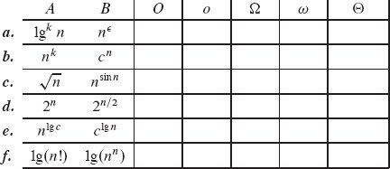

# 表征运行时间

第 2 章中定义的算法运行时间的增长顺序提供了一种简单的方法来表征算法的效率，还允许我们将其与其他算法进行比较。 一旦输入大小 n 变得足够大，合并排序的最坏情况运行时间为 Θ(n lg n)，胜过插入排序，其最坏情况运行时间为 $Θ(n^{2})$。 虽然我们有时可以确定算法的准确运行时间，就像我们在第 2 章中对插入排序所做的那样，但额外的精度很少值得计算它的努力。 对于足够大的输入，精确运行时间的乘法常数和低阶项受输入大小本身的影响。
当我们查看足够大的输入大小以仅与运行时间的增长顺序相关时，我们正在研究算法的渐近效率。 也就是说，我们关心的是算法的运行时间如何随着输入的大小在极限内增加，因为输入的大小无限制地增加。 通常，渐近更有效的算法是除了非常小的输入之外的所有输入的最佳选择。
本章给出了几种简化算法渐近分析的标准方法。 下一节非正式地介绍了三种最常用的"渐近符号"类型，我们已经在 Θ 符号中看到了其中的一个例子。 它还展示了一种使用这些渐近符号来推断插入排序的最坏情况运行时间的方法。 然后，我们更正式地研究渐近符号，并介绍本书中使用的几种符号约定。 最后一节回顾了分析算法时通常出现的函数行为。

## 3.1 O 符号、Ω 符号和 Θ 符号

我们在第2章分析插入排序的最坏情况运行时间时，从复杂的表达式入手

$$
(\frac{c_{5}}{2}+\frac{c_{6}}{2}+\frac{c_{7}}{2})n^{2}+(c_{1}+c_{2}+c_{4}+\frac{c_{5}}{2}-\frac{c_{6}}{2}-\frac{c_{7}}{2}+c_{8})n-(c_{2}+c_{4}+c_{5}+c_{8})
$$
然后我们丢弃了低阶项 (c~1~ + c~2~ + c~4~ + c~5~/2 – c~6~/2 – c~7~/2 + c~8~)n 和 c~2~ + c~4~ + c~5~ + c~8~，我们也忽略了系数 c~5~/2 + c~6~ /2 + n^2^ 的 c~7~/2。 这只剩下因子 n^2^，我们将其放入 Θ 表示法中作为 Θ(n^2^)。 我们使用这种风格来描述算法的运行时间：丢弃低阶项和前项的系数，并使用关注运行时间增长率的符号。
Θ 符号并不是唯一的此类"渐近符号"。 在本节中，我们还将看到其他形式的渐近符号。 我们从直观地了解这些符号开始，重新审视插入排序以了解我们如何应用它们。 在下一节中，我们将看到渐近符号的正式定义，以及使用它们的约定。
在我们进入具体细节之前，请记住，我们将看到的渐近符号被设计成可以表征一般函数。 碰巧我们最感兴趣的函数表示算法的运行时间。 但是渐近符号可以应用于表征算法某些其他方面的函数（例如，它们使用的空间量），甚至可以应用于与算法无关的函数。

### O 符号

O 符号表示函数渐近行为的上限。 换句话说，它表示根据最高阶项，函数的增长速度不超过特定速率。 例如，考虑函数 7n^3^ + 100n^2^ – 20n + 6。它的最高阶项是 7n^3^，所以我们说这个函数的增长率是 n^3^。 因为这个函数的增长速度不比 n^3^ 快，所以我们可以写成 O(n^3^)。 你可能会惊讶于我们还可以写出函数 7n^3^ + 100n^2^ – 20n + 6 的复杂度为 O(n^4^)。 为什么？ 因为该函数的增长速度比 n^4^ 慢，所以我们说它增长速度并不快是正确的。 正如你可能已经猜到的，这个函数也是 O(n^5^)、O(n^6^) 等。 更一般地，对于任何常数 c ≥ 3，它是 O(n^c^)。

### Ω符号

Ω 符号表示函数渐近行为的下界。 换句话说，它表示一个函数的增长速度至少与某个特定速率一样快，这是基于最高阶项的——就像在 O 符号中一样。 因为函数 7n^3^ + 100n^2^ – 20n + 6 中的最高阶项至少和 n^3^ 一样快地增长，所以这个函数是 Ω(n^3^)。 这个函数也是 Ω(n^2^) 和 Ω(n)。 更一般地，对于任何常数 c ≤ 3，它是 Ω(n^c^)。

### Θ-表示法

Θ 符号表示函数渐近行为的紧界。 它表示函数以特定速率精确增长，再次基于最高阶项。 换句话说，Θ 表示法将函数的增长率表征为从上方到常数因子以内和从下方到常数因子。 这两个常数因子不必相等。
如果你能证明一个函数对于某个函数 f(n) 既是 O(f(n)) 又是 Ω(f(n))，那么你就证明了这个函数是 Θ(f(n))。 （下一节将此事实作为定理陈述。）例如，由于函数 7n^3^ + 100n^2^ – 20n + 6 既是 O(n^3^) 又是 Ω(n^3^)，因此它也是 Θ(n^3^)。

#### 示例：插入排序

让我们重新审视插入排序，看看如何使用渐近符号来表征其 Θ(n^2^) 最坏情况运行时间，而不像我们在第 2 章中所做的那样评估求和。这里再次是 INSERTION-SORT 过程：

```python
INSERTION-SORT(A, n)
for i = 2 to n
    key = A[i]                                # 将 A[i] 插入已排序的子数组 A[1 : i – 1]
    j = i – 1
    while j > 0 and A[j] > key
        A[j + 1] = A[j]
        j = j – 1
    A[j + 1] = key
```

关于伪代码的运行方式，我们可以观察到什么？ 该过程具有嵌套循环。 外层循环是一个 for 循环，它运行 n – 1 次，与排序的值无关。 内部循环是一个 while 循环，但它进行的迭代次数取决于要排序的值。 循环变量 j 从 i – 1 开始，在每次迭代中减 1，直到达到 0 或 A[j] ≤ key。 对于给定的 i 值，while 循环可能迭代 0 次、i – 1 次或介于两者之间的任何位置。 while 循环的主体（第 6-7 行）在 while 循环的每次迭代中花费常数时间。


图 3.1 插入排序的 Ω(n^2^) 下界。 如果前 n/3 个位置包含 n/3 个最大值，则这些值中的每一个都必须移动通过每个中间 n/3 个位置，一次一个位置，最终到达最后 n/3 个位置的某个位置。 由于 n/3 个值中的每一个都至少移动通过 n/3 个位置中的每一个，因此在这种情况下所花费的时间至少与 (n/3)(n/3) = n^2^/9 或 Ω(n^2^) 成正比。
这些观察结果足以推断出任何 INSERTION-SORT 情况下的 O(n^2^) 运行时间，从而为我们提供涵盖所有输入的一揽子声明。 运行时间以内循环为主。 因为外层循环的每n-1次迭代都会导致内层循环最多迭代i-1次，又因为i至多为n，所以内层循环的总迭代次数最多为(n-1) (n – 1)，小于 n^2^。 由于内循环的每次迭代都需要常数时间，因此内循环花费的总时间至多为常数乘以 n^2^，即 O(n^2^)。
稍加创意，我们还可以看出INSERTION-SORT的最坏情况运行时间为Ω(n^2^)。 说算法的最坏情况运行时间是 Ω(n^2^)，我们的意思是对于每个大于特定阈值的输入大小 n，至少有一个大小为 n 的输入，算法至少需要 cn^2^ 时间， 对于一些正常数 c。 这并不一定意味着该算法对所有输入至少花费 cn^2^ 时间。
现在让我们看看为什么 INSERTION-SORT 的最坏情况运行时间是 Ω(n^2^)。 一个值要结束到它开始位置的右边，它必须在第 6 行移动。事实上，要一个值结束到它开始位置右边的 k 个位置，第 6 行必须执行 k 次。 如图 3.1 所示，假设 n 是 3 的倍数，这样我们就可以将数组 A 分成 n/3 个位置的组。 假设在 INSERTION-SORT 的输入中，n/3 个最大值占据了前 n/3 个数组位置 A[1 : n/3]。 （它们在前 n/3 个位置中的相对顺序无关紧要。）一旦对数组进行排序，这 n/3 个值中的每一个都会在最后 n/3 个位置的某个位置结束 A[2n/3 + 1 :n]. 为此，这 n/3 个值中的每一个都必须通过中间 n/3 个位置 A[n/3 + 1 : 2n/3] 中的每一个。 通过第 6 行的至少 n/3 次执行，这 n/3 个值中的每一个通过这些中间的 n/3 个位置一次一个位置。因为至少 n/3 个值必须通过至少 n/3 个位置， 在最坏的情况下，INSERTION-SORT 所花费的时间至少与 (n/3)(n/3) = n^2^/9 成正比，即 Ω(n^2^)。
因为我们已经证明 INSERTION-SORT 在所有情况下都在 O(n^2^) 时间内运行，并且存在使其花费 Ω(n^2^) 时间的输入，所以我们可以得出结论，INSERTION-SORT 的最坏情况运行时间是 Θ (n^2^)。 上限和下限的常数因子可能不同并不重要。 重要的是我们已经将最坏情况下的运行时间特征化为常数因子（折扣低阶项）。 该论证并未表明 INSERTION-SORT 在所有情况下都在 Θ(n^2^) 时间内运行。 事实上，我们在第 2 章中看到，最佳情况下的运行时间是 Θ(n)。

### 练习

**3.1-1** 修改插入排序的下限参数以处理不一定是 3 的倍数的输入大小。
**3.1-2** 使用类似于我们用于插入排序的推理，分析练习 2.2-2 中选择排序算法的运行时间。
**3.1-3** 假设 α 是 0 < α < 1 范围内的分数。说明如何推广插入排序的下限参数，以考虑其中 αn 最大值从前 αn 个位置开始的输入。 你需要对 α 施加什么额外限制？ 什么 α 值最大化 αn 最大值必须通过每个中间 (1 – 2α)n 数组位置的次数？

## 3.2 渐近符号：正式定义

非正式地看过渐近符号之后，让我们更正式一些。 我们用来描述算法渐近运行时间的符号是根据函数定义的，函数的定义域通常是自然数集合 N 或实数集合 R。 这样的符号便于描述运行时函数 T (n)。 本节定义了基本的渐近符号，还介绍了一些常见的"适当"符号滥用。


图 3.2 O、Ω 和 Θ 符号的图形示例。 在每个部分中，显示的 n0 值是可能的最小值，但任何更大的值也适用。 (a) O 表示法给出函数在常数因子内的上限。 我们写 f (n) = O(g(n)) 如果存在正常数 n0 和 c 使得在 n0 和右边，f (n) 的值总是在或低于 cg(n)。 (b) Ω 符号给出函数在常数因子内的下界。 我们写 f (n) = Ω(g(n)) 如果存在正常数 n0 和 c，使得在 n0 和右边，f (n) 的值总是位于或高于 cg(n)。 (c) Θ 符号将函数限制在常数因子内。 我们写 f (n) = Θ(g(n)) 如果存在正常数 n~0~、c~1~ 和 c~2~，使得在 n~0~ 和右边，f (n) 的值总是介于 c~1~g(n) 和 c~2~g(n) 包括在内。

### O 符号

正如我们在 3.1 节中看到的，O 符号描述了一个渐近上界。 我们使用 O 表示法给出函数的上限，在一个常数因子内。
这是 O-notation 的正式定义。 对于给定的函数 g(n)，我们用 O(g(n))（发音为"big-oh of g of n"，有时简称为"oh of g of n"）表示函数集

> O(g(n)) = {f (n)	 : 	存在正常数 c 和 n0 使得 0 ≤ f (n) ≤ cg(n) 对于所有 n ≥ n0}.^1^

函数 f (n) 属于集合 O(g(n)) 如果存在一个正常数 c 使得 f (n) ≤ cg(n) 对于足够大的 n。 图 3.2(a) 显示了 O 符号背后的直觉。 对于 n0 和 n0 右侧的所有值 n，函数 f (n) 的值等于或低于 cg(n)。
O(g(n)) 的定义要求集合 O(g(n)) 中的每个函数 f (n) 渐近非负：只要 n 足够大，f (n) 就必须是非负的。 （渐近正函数是对所有足够大的 n 都为正的函数。）因此，函数 g(n) 本身必须渐近非负，否则集合 O(g(n)) 为空。 因此，我们假设 O 表示法中使用的每个函数都是渐近非负的。 这个假设也适用于本章中定义的其他渐近符号。
你可能会对我们根据集合定义 O 表示法感到惊讶。 实际上，你可能希望我们写成"f (n) ∈ O(g(n))"来表示 f (n) 属于集合 O(g(n))。 相反，我们通常写"f (n) = O(g(n))"并说"f (n) is big-oh of g(n)"来表达相同的概念。 虽然以这种方式滥用平等一开始可能看起来令人困惑，但我们将在本节后面看到这样做有其优势。
让我们探索一个示例，说明如何使用 O 表示法的正式定义来证明我们丢弃低阶项并忽略最高阶项的常数系数的做法是正确的。 我们将证明 4n^2^ + 100n + 500 = O(n^2^)，即使低阶项的系数比前项大得多。 我们需要找到正常数 c 和 n~0~，使得 4n^2^ + 100n + 500 ≤ cn^2^ 对于所有 n ≥ n~0~。 两边除以 n^2^ 得出 4 + 100/n + 500/n^2^ ≤ c。 对于 c 和 n~0~ 的许多选择都满足此不等式。 例如，如果我们选择 n~0~ = 1，则此不等式适用于 c = 604。如果我们选择 n~0~ = 10，则 c = 19 有效，而选择 n~0~ = 100 允许我们使用 c = 5.05。
我们也可以用 O-notation 的形式定义来证明函数 n^3^ – 100n^2^ 不属于集合 O(n^2^)，即使 n^2^ 的系数是一个很大的负数。 如果我们有 n^3^ – 100n^2^ = O(n^2^)，那么将存在正常数 c 和 n~0~，使得对于所有 n ≥ n~0~，n^3^ –100n^2^ ≤ cn^2^。 同样，我们将两边除以 n^2^，得到 n – 100 ≤ c。 无论我们为常数 c 选择什么值，这个不等式对于 n > c + 100 的任何值都不成立。

### Ω符号

正如 O 符号提供函数的渐近上界一样，Ω 符号提供渐近下界。 对于给定的函数 g(n)，我们用 Ω(g(n))（发音为"big-omega of g of n"或有时简称为"omega of g of n"）表示函数集

> Ω(g(n)) = {f (n)	 : 	存在正常数 c 和 n~0~ 使得 0 ≤ cg(n) ≤ f (n) 对于所有 n ≥ n~0~}.

图 3.2(b) 显示了 Ω 符号背后的直觉。 对于 n0 处或右侧的所有值 n，f (n) 的值在 cg(n) 之上或之上。
我们已经证明 4n^2^ + 100n + 500 = O(n^2^)。 现在让我们证明 4n^2^ + 100n + 500 = Ω(n^2^)。 我们需要找到正常数 c 和 n~0~，使得 4n^2^ + 100n + 500 ≥ cn^2^ 对于所有 n ≥ n~0~。 和以前一样，我们将两边除以 n^2^，得到 4 + 100/n + 500/n^2^ ≥ c。 当 n~0~ 是任何正整数且 c = 4 时，此不等式成立。
如果我们从 4n^2^ 项中减去低阶项而不是相加会怎样？ 如果 n^2^ 项的系数很小怎么办？ 该函数仍为 Ω(n^2^)。 例如，让我们证明 n^2^/100 – 100n – 500 = Ω(n^2^)。 除以 n^2^ 得出 1/100 – 100/n – 500/n^2^ ≥ c。 我们可以为 n~0~ 选择任何至少为 10,005 的值，并为 c 找到一个正值。 例如，当 n~0~ = 10,005 时，我们可以选择 c = 2.49 × 10–9。 是的，这对于 c 来说是一个很小的值，但它是正的。 如果我们为 n~0~ 选择一个更大的值，我们也可以增加 c。 例如，如果 n~0~ = 100,000，那么我们可以选择 c = 0.0089。 n~0~ 的值越大，我们可以选择的 c 越接近系数 1/100。

### Θ-表示法

我们使用 Θ 表示法表示渐近紧界。 对于给定的函数 g(n)，我们用 Θ(g(n))（"theta of g of n"）表示函数集

> Θ(g(n)) = {f (n)	 : 	存在正常数 c~1~、c~2~ 和 n~0~，使得 0 ≤ c1g(n) ≤ f (n) ≤ c~2~g(n) 对于所有 n ≥ n~0~}.

图 3.2(c) 显示了 Θ 符号背后的直觉。 对于 n0 处和右侧的所有 n 值，f (n) 的值等于或高于 c1g(n) 且等于或低于 c2g(n)。 换句话说，对于所有 n ≥ n0，函数 f (n) 在常数因子内等于 g(n)。
O-、Ω- 和 Θ- 符号的定义引出了以下定理，我们将其证明留作练习 3.2-4。
#### 定理 3.1
对于任意两个函数 f (n) 和 g(n)，我们有 f (n) = Θ(g(n)) 当且仅当 f (n) = O(g(n)) 和 f (n) = Ω(g(n))

我们通常应用定理 3.1 从渐近上下界证明渐近紧界。

### 渐近符号和运行时间

当你使用渐近符号来表征算法的运行时间时，请确保你使用的渐近符号尽可能精确，不要夸大其适用的运行时间。 以下是正确和不正确地使用渐近符号来表征运行时间的一些示例。
让我们从插入排序开始。 我们可以正确地说插入排序的最坏情况运行时间是 O(n^2^)、Ω(n^2^)，并且——根据定理 3.1——Θ(n^2^)。 尽管表征最坏情况运行时间的所有三种方法都是正确的，但 Θ(n^2^) 界限是最精确的，因此也是最优选的。 我们还可以正确地说，插入排序的最佳运行时间是 O(n)、Ω(n) 和 Θ(n)，其中 Θ(n) 是最精确的，因此也是最优选的。
这是我们不能正确说的：插入排序的运行时间是 Θ(n^2^)。 这是一种夸大的说法，因为通过从声明中省略"最坏情况"，我们得到了涵盖所有情况的一揽子声明。 这里的错误是插入排序并非在所有情况下都在 Θ(n^2^) 时间内运行，因为正如我们所见，它在最佳情况下在 Θ(n) 时间内运行。 然而，我们可以正确地说插入排序的运行时间是 O(n^2^)，因为在所有情况下，它的运行时间增长都不比 n^2^ 快。 当我们说 O(n^2^) 而不是 Θ(n^2^) 时，运行时间增长比 n^2^ 慢的情况是没有问题的。 同样，我们不能正确地说插入排序的运行时间是 Θ(n)，但我们可以说它的运行时间是 Ω(n)。
合并排序怎么样？ 由于合并排序在所有情况下都在 Θ(n lg n) 时间内运行，我们可以只说它的运行时间是 Θ(n lg n) 而无需指定最坏情况、最佳情况或任何其他情况。
人们有时会错误地使用 O 表示法来表示渐近紧界，从而将 O 表示法与 Θ 表示法混为一谈。 他们说"时间复杂度为 O(n lg n) 的算法比时间复杂度为 O(n^2^) 的算法运行得更快"。 也许会，也许不会。 由于 O 符号仅表示渐近上限，因此所谓的 O(n^2^) 时间算法实际上可能在 Θ(n) 时间内运行。 你应该谨慎选择合适的渐近符号。 如果要表示渐近紧界，请使用 Θ 符号。
我们通常使用渐近符号来提供最简单和最精确的边界。 例如，如果一个算法在所有情况下的运行时间都是 3n^2^ + 20n，我们用渐近记法写它的运行时间是 Θ(n^2^)。 严格来说，我们写运行时间为 O(n^3^) 或 Θ(3n^2^ + 20n) 也是正确的。 在这种情况下，这些表达式都不如写 Θ(n^2^) 有用，但是：如果运行时间为 3n^2^ + 20n，则 O(n^3^) 不如 Θ(n^2^) 精确，并且 Θ(3n^2^ + 20n) 引入了复杂性 混淆了生长顺序。 通过写出最简单和最精确的边界，例如 Θ(n^2^)，我们可以对不同的算法进行分类和比较。 在整本书中，你将看到几乎总是基于多项式和对数的渐近运行时间：诸如 n、n lg^2^ n、n^2^ lg n 或 n^1/2^ 之类的函数。 你还将看到一些其他函数，例如指数函数、lg lg n 和 lg*n（请参阅第 3.3 节）。 比较这些功能的增长率通常相当容易。 问题 3-3 给了你很好的练习。

### 方程和不等式中的渐近符号

尽管我们根据集合正式定义渐近符号，但我们在公式中使用等号 (=) 而不是集合隶属符号 (∈)。 例如，我们写成 4n^2^ + 100n + 500 = O(n^2^)。 我们也可以写成 2n^2^ + 3n + 1 = 2n^2^ + Θ(n)。 我们如何解释这些公式？
当渐近符号单独存在（即不在更大的公式中）在方程（或不等式）的右侧时，如 4n^2^ + 100n + 500 = O(n^2^)，等号表示集合成员： 4n^2^ + 100n + 500 ∈ O(n^2^)。 然而，一般来说，当渐近符号出现在公式中时，我们将其解释为代表某个我们不想命名的匿名函数。 例如，公式 2n^2^ + 3n + 1 = 2n^2^ + Θ(n) 表示 2n^2^ + 3n + 1 = 2n^2^ + f (n)，其中 f (n) ∈ Θ(n)。 在这种情况下，我们让 f (n) = 3n + 1，这确实属于 Θ(n)。
以这种方式使用渐近符号可以帮助消除方程中不重要的细节和混乱。 例如，在第 2 章中，我们将归并排序的最坏情况运行时间表示为递归
$$
T (n) = 2T (n/2) + \Theta (n)
$$
如果我们只对 T (n) 的渐近行为感兴趣，则没有必要准确指定所有低阶项，因为它们都被理解为包含在由项 Θ(n) 表示的匿名函数中。
表达式中匿名函数的数量被理解为等于渐近符号出现的次数。 例如，在表达式中
$$
\sum_{i=0}^{n}O(i) 
$$
只有一个匿名函数（i 的函数）。 因此，这个表达式与 O(1) + O(2) + ... + O(n) 不同，后者实际上没有清晰的解释。
在某些情况下，渐近符号出现在等式的左侧，如
$$
2n2 + \Theta (n) = \Theta (n2)
$$
使用以下规则解释此类方程式：无论如何选择等号左侧的匿名函数，都有一种方法可以选择等号右侧的匿名函数以使等式有效。 因此，我们的示例意味着对于任何函数 f (n) ∈ Θ(n)，存在某个函数 g(n) ∈ Θ(n^2^) 使得对于所有 n，2n^2^ + f (n) = g(n)。 换句话说，等式的右边比左边提供了更粗略的细节。
我们可以将许多这样的关系链接在一起，例如
$$
2n^{2}+3n+1=2n^{2}+\Theta (n)=\Theta (n^{2})
$$
根据上述规则，分别解释每个方程。 第一个方程表示存在某个函数 f (n) ∈ Θ(n) 使得 2n^2^ + 3n + 1 = 2n^2^ + f (n) 对于所有 n。 第二个方程表示对于任何函数 g(n) ∈ Θ(n)（例如刚才提到的 f (n)），存在某个函数 h(n) ∈ Θ(n^2^) 使得 2n^2^ + g(n) = h(n) 对于所有 n。 这种解释意味着 2n^2^ + 3n + 1 = Θ(n^2^)，这是方程式链接的直观说法。

### 适当滥用渐近符号

除了滥用相等性来表示集合成员资格（我们现在看到它有精确的数学解释）之外，当必须从上下文中推断出趋向于 ∞ 的变量时，会发生另一种渐近符号的滥用。 例如，当我们说 O(g(n)) 时，我们可以假设我们对 g(n) 随着 n 增长的增长感兴趣，如果我们说 O(g(m)) 我们在谈论 g(m) 随着 m 的增长而增长。 表达式中的自由变量表示哪个变量将趋向于∞。
当渐近符号内的函数是常数时，最常见的情况需要了解哪个变量趋向于 ∞，如表达式 O(1) 中那样。 我们无法从表达式中推断出哪个变量会趋向于 ∞，因为那里没有变量出现。 上下文必须消除歧义。 例如，如果使用渐近符号的方程是 f (n) = O(1)，显然我们感兴趣的变量是 n。 然而，从上下文中知道感兴趣的变量是 n，允许我们通过使用 O 符号的正式定义来完全理解表达式：表达式 f (n) = O(1) 意味着函数 f (n ) 在 n 趋于 ∞ 时，由一个常数从上方界定。 从技术上讲，如果我们在渐近符号本身中明确指出趋向于 ∞ 的变量，可能会减少歧义，但这会使符号混乱。 相反，我们只是确保上下文清楚地表明哪个变量（或多个变量）倾向于 ∞。
当渐近符号内的函数受正常数限制时，如 T (n) = O(1)，我们经常以另一种方式滥用渐近符号，尤其是在陈述递归时。 对于 n < 3，我们可以写成类似 T (n) = O(1) 的形式。根据 O-notation 的正式定义，这个陈述是没有意义的，因为定义只说 T (n) 是有界的 对于某些 n~0~ > 0，对于 n ≥ n~0~，常数 c。对于 n < n~0~，T (n) 的值不需要如此有界。 因此，在示例 T (n) = O(1) for n < 3 中，当 n < 3 时，我们无法推断出对 T (n) 的任何约束，因为它可能是 n~0~ > 3。
当我们说 T (n) = O(1) for n < 3 时，通常意味着存在一个正常数 c 使得 T (n) ≤ c for n < 3。这个约定省去了我们命名的麻烦 边界常数，允许它在我们专注于分析中更重要的变量时保持匿名。 类似的滥用也发生在其他渐近符号中。 例如，对于 n < 3，T (n) = Θ(1) 表示当 n < 3 时，T (n) 上下受正常数限制。
有时，描述算法运行时间的函数可能没有为某些输入大小定义，例如，当算法假设输入大小是 2 的精确幂时。我们仍然使用渐近符号来描述运行时间的增长， 了解任何约束仅在定义函数时适用。 例如，假设 f (n) 仅在自然数或非负实数的子集上定义。 那么 f (n) = O(g(n)) 意味着 O 符号定义中的界限 0 ≤ T (n) ≤ cg(n) 对于 f (n) 域上的所有 n ≥ n~0~ 都成立， 即，其中定义了 f (n)。 这种滥用很少被指出，因为从上下文中可以清楚地看出其含义。
在数学中，滥用符号是可以的——而且通常是可取的——只要我们不滥用它。 如果我们准确理解滥用的含义并且不得出错误的结论，它可以简化我们的数学语言，有助于我们更高层次的理解，并帮助我们专注于真正重要的事情。

### 符号

O 符号提供的渐近上界可能是也可能不是渐近紧的。 边界 2n^2^ = O(n^2^) 是渐近紧的，但边界 2n = O(n^2^) 不是。 我们使用 o 符号来表示一个非渐近紧的上界。 我们正式定义 o(g(n))（"little-oh of g of n"）作为集合

> o(g(n)) = {f (n)	 : 	对于任何正常数 c > 0，存在一个常数 n~0~ > 0 使得 0 ≤ f (n) < cg(n) 对于所有 n ≥ n~0~}.

例如，2n = o(n^2^)，但 2n^2^ ≠ o(n^2^)。
O-notation 和 o-notation 的定义是相似的。 主要区别在于，在 f (n) = O(g(n)) 中，边界 0 ≤ f (n) ≤ cg(n) 对于某个常数 c > 0 成立，但在 f (n) = o(g (n))，边界 0 ≤ f (n) < cg(n) 对所有常量 c > 0 成立。直观地，在 o 表示法中，函数 f (n) 相对于 g(n) 随着 n 变得无关紧要 大：
$$
\lim_{n \to \infty} \frac{f(n)}{g(n)} 
$$
一些作者使用此限制作为 o-notation 的定义，但本书中的定义也将匿名函数限制为渐近非负。

### ω-符号

以此类推，ω-符号之于 Ω-符号就像 o-符号之于 O-符号一样。 我们使用 ω 符号来表示一个非渐近紧的下界。 定义它的一种方法是

> f (n) ∈ ω(g(n))    当且仅当 g(n) ∈ o(f (n))

然而，正式地，我们将 ω(g(n))（"little-omega of g of n"）定义为集合

> ω(g(n)) = {f (n) : 对于任何正常数 c > 0，存在一个常数 n~0~ > 0 使得 0 ≤ cg(n) < f (n) 对于所有 n ≥ n~0~}

o 表示法的定义表示 f (n) < cg(n)，而 ω 表示法的定义则相反：cg(n) < f (n)。 对于 ω 符号的示例，我们有 n^2^/2 = ω(n)，但 n^2^/2 ≠ ω(n^2^)。 关系 f (n) = ω(g(n)) 意味着

$$
\lim_{n \to \infty} \frac{f(n)}{g(n)} =\infty
$$
如果存在限制。 也就是说，随着 n 变大，f (n) 相对于 g(n) 变得任意大。

### 比较函数

实数的许多关系属性也适用于渐近比较。 对于以下内容，假设 f (n) 和 g(n) 渐近为正。

#### 传递性：

f (n) = Θ(g(n))	and	g(n) = Θ(h(n))	imply	f (n) = Θ(h(n)),
f (n) = O(g(n))	and	g(n) = O(h(n))	imply	f (n) = O(h(n)),
f (n) = Ω(g(n))	and	g(n) = Ω(h(n))	imply	f (n) = Ω(h(n)),
f (n) = o(g(n))	and	g(n) = o(h(n))	imply	f (n) = o(h(n)),
f (n) = ω(g(n))	and	g(n) = ω(h(n))	imply	f (n) = ω(h(n)).

#### 自反性：

f(n) = Θ(f(n)),
f(n) = O(f(n)),
f(n) = Ω(f(n))。

#### 对称性：

f (n) = Θ(g(n)) 当且仅当 g(n) = Θ(f (n))。

#### 转置对称性：

f (n) = O(g(n)) 当且仅当 g(n) = Ω(f (n))，
f (n) = o(g(n)) 当且仅当 g(n) = ω(f (n))。
因为这些性质适用于渐近符号，所以我们可以在两个函数 f 和 g 的渐近比较与两个实数 a 和 b 的比较之间进行类比：
f (n) = O(g(n)) 就像 a ≤ b，
f (n) = Ω(g(n)) 就像 a ≥ b,
f (n) = Θ(g(n)) 就像 a = b，
f (n) = o(g(n)) 就像 a < b,
f (n) = ω(g(n)) 就像 a > b。

如果 f (n) = o(g(n))，我们说 f (n) 渐近小于 g(n)，如果 f (n) = ω( g(n))。
然而，实数的一个性质不会延续到渐近符号：
**三分法**：对于任意两个实数 a 和 b，必须满足以下条件之一：a < b、a = b 或 a > b。

尽管可以比较任意两个实数，但并非所有函数都可以渐近比较。 也就是说，对于两个函数 f (n) 和 g(n)，可能出现 f (n) = O(g(n)) 和 f (n) = Ω(g(n)) 都不成立的情况。 例如，我们不能使用渐近符号比较函数 n 和 n1 + sin n，因为 n1 + sin n 中的指数值在 0 和 2 之间振荡，取其间的所有值。

### 练习

**3.2-1** 令 f (n) 和 g(n) 为渐近非负函数。 使用 Θ 符号的基本定义，证明 max {f (n), g(n)} = Θ(f (n) + g(n))。
**3.2-2** 解释为什么"算法 A 的运行时间至少为 O(n^2^)"这一陈述毫无意义。
**3.2-3**  2^n^ + 1 = O(2^n^) 吗？ 2^2n^ = O(2^n^) 吗？
**3.2-4** 证明定理 3.1。
**3.2-5** 证明算法的运行时间为 Θ(g(n)) 当且仅当其最坏情况运行时间为 O(g(n)) 且其最佳情况运行时间为 Ω(g(n))。
**3.2-6** 证明 o(g(n)) ∩ ω(g(n)) 是空集。
**3.2-7** 我们可以将我们的符号扩展到两个参数 n 和 m 的情况，它们可以以不同的速率独立地达到 ∞。 对于给定的函数 g(n, m)，我们用 O(g(n, m)) 表示函数集

> O(g(n, m)) = {f (n, m) : 存在正常数 c、n~0~ 和 m~0~ 使得 0 ≤ f (n, m) ≤ cg(n, m) 对于所有 n ≥ n~0~ 或 m ≥ m~0~}。

给出 Ω(g(n, m)) 和 Θ(g(n, m)) 的相应定义。 

## 3.3 标准符号和常用函数

本节回顾一些标准的数学函数和符号，并探讨它们之间的关系。 它还说明了渐近符号的使用。
单调性

如果 m ≤ n 意味着 f (m) ≤ f (n)，则函数 f (n) 是单调递增的。 类似地，如果 m ≤ n 意味着 f (m) ≥ f (n)，则它是单调递减的。 如果 m < n 意味着 f (m) < f (n)，则函数 f (n) 严格递增；如果 m < n 意味着 f (m) > f (n)，则函数 f (n) 严格递减。
地板和天花板

对于任何实数 x，我们用 ⌊x⌋（读作"x 的下限"）表示小于或等于 x 的最大整数，用 ⌈x⌉（读作"x 的上限"）表示大于或等于 x 的最小整数 X"）。 下限函数单调递增，上限函数也是如此。
地板和天花板遵循以下属性。 对于任何整数 n，我们有
$$
\left \lfloor n \right \rfloor =n=\left \lceil n \right \rceil 
$$
对于所有实数 x，我们有
$$
x-1< \left \lfloor x \right \rfloor \le x\le \left \lceil x \right \rceil < x+1
$$
我们还有
$$
-\left \lfloor x \right \rfloor =\left \lceil -x \right \rceil 
$$
或者等价地，
$$
-\left \lceil x \right \rceil =\left \lfloor -x \right \rfloor
$$
对于任何实数 x ≥ 0 和整数 a、b > 0，我们有
$$
\left \lceil \frac{\left \lceil x/a \right \rceil }{b}  \right \rceil =\left \lceil \frac{x}{ab}  \right \rceil
$$
$$
\left \lfloor \frac{\left \lfloor x/a \right \rfloor }{b}  \right \rfloor =\left \lfloor \frac{x}{ab}  \right \rfloor
$$
$$
\left \lceil \frac{a}{b}  \right \rceil \le \frac{a+(b-1)}{b} 
$$
$$
\left \lfloor \frac{a}{b}  \right \rfloor \ge \frac{a-(b-1)}{b}
$$
对于任何整数 n 和实数 x，我们有
$$
\left \lfloor n+x \right \rfloor = n+\left \lfloor x \right \rfloor
$$

$$
\left \lceil n+x \right \rceil = n+\left \lceil x \right \rceil 
$$

### 模运算

对于任何整数 a 和任何正整数 n，a mod n 的值是商 a/n 的余数（或余数）：

$$
a\ mod\ n=a-n\left \lfloor a/n \right \rfloor 
$$
它遵循

$$
0 \le a\ mod\ n< n
$$
即使 a 为负数。
给定一个整数除以另一个整数的余数的定义明确的概念，提供特殊符号来指示余数相等是很方便的。 如果 (a mod n) = (b mod n)，我们写 a = b (mod n) 并说 a 等价于 b，模 n。 换句话说，如果 a 和 b 除以 n 时余数相同，则 a = b (mod n)。 等价地，a = b (mod n) 当且仅当 n 是 b – a 的约数。 如果 a 不等于 b，模 n，我们写 a ≠ b (mod n)。

### 多项式

给定一个非负整数 d，n 次 d 的多项式是以下形式的函数 p(n)
$$
p(n)=\sum_{i=0}^{d}a_{i}n^{i} 
$$
其中常数 a~0~, a~1~, … , a~d~ 是多项式的系数并且 a~d~ ≠ 0。当且仅当 a~d~ > 0 时，多项式是渐近正的。对于 d 次的渐近正多项式 p(n)，我们有 p (n) = Θ(n~d~)。 对于任何实常数 a ≥ 0，函数 n^a^ 单调递增，对于任何实常数 a ≤ 0，函数 n^a^ 单调递减。 如果 f (n) = O(n^k^) 对于某个常数 k，我们说函数 f (n) 是多项式有界的。

### 指数

对于所有实数 a > 0、m 和 n，我们有以下恒等式：
$$
a^{0}=1
$$

$$
a^{1}=a
$$

$$
a^{–1}=1/a
$$

$$
(a^{m})^{n}=a^{mn}
$$

$$
(a^{m})^{n}=(a^{n})^{m}
$$

$$
a^{m}a^{n}=a^{m+n}
$$

对于所有 n 和 a ≥ 1，函数 an 在 n 中单调递增。 方便时，我们假设 $0^{0}=1$。
我们可以通过以下事实将多项式和指数的增长率联系起来。 对于所有实常数 a > 1 和 b，我们有
$$
\lim_{x \to \infty} \frac{n^{b}}{a^{n}} =0
$$
从中我们可以得出结论

$$
n^{b}=o(a^{n})
$$
因此，任何底数严格大于 1 的指数函数比任何多项式函数增长得都快。
使用 e 表示 2.71828 …，自然对数函数的底，对于所有实数 x，我们有，
$$
e^{x}=1+x+\frac{x^{2}}{2!}+\frac{x^{3}}{3!}+\cdots =\sum_{i=0}^{\infty}  \frac{x^{i}}{i!} 
$$
这里 "！" 表示本节后面定义的阶乘函数。 对于所有实数 x，我们有不等式

$$
1+x \le e^{x}
$$
其中等式仅在 x = 0 时成立。当 |x| 时 ≤ 1，我们有近似值

$$
1+x \le e^{x} \le 1+x+x^{2}
$$
当 x → 0 时，用 1 + x 对 ex 的近似是相当好的：

$$
e^{x} = 1 + x + Θ(x^{2}).
$$
（在这个等式中，渐近符号用于将极限行为描述为 x → 0 而不是 x → ∞。）对于所有 x，我们有，

$$
\lim_{x \to \infty} (1+\frac{x}{n} )^{n}=e^{x}
$$

### 对数

我们使用以下符号：
$$
lg n =	log_{2}n  \ 	(二进制对数) \\
ln n =	log_{e}n  \ 	(自然对数) \\
lgk n =	(lg n)^{k}	\ (求幂) \\
lg lg n =	lg(lg n) \ 	(组合)
$$
我们采用以下符号约定：在没有括号的情况下，对数函数仅适用于公式中的下一项，因此 lg n + 1 表示 (lg n) + 1 而不是 lg(n + 1)。
对于任何常数 b > 1，如果 n ≤ 0，则函数 logb n 未定义，如果 n > 0 则严格递增，如果 0 < n < 1 则为负，如果 n > 1 则为正，如果 n = 1 则为 0。对于所有实数 a > 0, b > 0, c > 0, 和 n, 我们有
$$
a = b^{log_{b}a} \\
log_{c}(ab)=log_{c}a + log_{c}b \\
log_{b}a^{n}=nlog_{b}a \\
log_{b}a=\frac{log_{c}a}{log_{c}b}\\ 
log_{b}(1/a)=-log_{b}a
log_{b}a=\frac{1}{log_{a}b}
a^{log_{b}c}=c^{log_{b}a} 
$$
其中，在上面的每个等式中，对数底数不为 1。
通过等式 (3.19)，将对数的底数从一个常数更改为另一个常数会仅以一个常数因子改变对数的值。 因此，当我们不关心常数因子时，我们经常使用符号"lg n"，例如 O 符号。 计算机科学家发现 2 是对数最自然的底数，因为许多算法和数据结构都涉及将问题分成两部分。
当 |x| 时，ln(1 + x) 有一个简单的级数展开 < 1:
$$
ln(1+x)=x-\frac{x^{2}}{2}+\frac{x^{3}}{3}-\frac{x^{4}}{4}+\frac{x^{5}}{5}-\cdots  
$$
对于 x > – 1，我们还有以下不等式：

$$
\frac{x}{1+x} \le ln(1+x) \le x
$$
其中等式仅适用于 x = 0。
如果 $f (n) = O(lg^{k}n)$ 对于某个常数 k，我们说函数 f (n) 是多对数有界的。 我们可以通过在等式（3.13）中用 lg n 代替 n 和 $2^{a}$ 代替 a 来关联多项式和多对数的增长。 对于所有实常数 a > 0 和 b，我们有
$$
lg^{b}n=o(n^{a})
$$
因此，任何正多项式函数比任何多对数函数增长得更快。

### 阶乘

符号 n! （读作"n 阶乘"）定义为整数 n ≥ 0
$$
n!=\left\{\begin{matrix}
  1 & \ if \ n=0\\
  n\cdot (n-1)! & if \ n>0
\end{matrix}\right.
$$
因此，n！ = 1 · 2 · 3⋯ n。
阶乘函数的弱上界是 n！ ≤ nn，因为阶乘积中的 n 项中的每一项至多为 n。 斯特林近似，
$$
n!=\sqrt{2\pi n} (\frac{n}{e} )^{n}(1+\Theta (\frac{1}{n} ))
$$
其中 e 是自然对数的底，为我们提供了更严格的上限和下限。 练习 3.3-4 要求你证明三个事实
$$
n!=o(n^{n}) \\ 
n!=\omega (2^{n})  \\ 
lg(n!)=\Theta (nlgn)
$$
其中斯特林近似有助于证明方程（3.28）。 以下等式也适用于所有 n ≥ 1：

$$
n!=\sqrt{2\pi n} (\frac{n}{e} )^{n}(\frac{n}{e})^{n}e^{\alpha _{n}}
$$
这里
$$
\frac{1}{12n+1} < \alpha  _{n} < \frac{1}{12n} 
$$

### 函数迭代

我们使用符号 $f^{(i)}(n)$ 来表示函数 f (n) 迭代应用 i 次到初始值 n。 形式上，设 f (n) 是实数上的函数。 对于非负整数 i，我们递归地定义
$$
f^{(i)}(n)=\left\{\begin{matrix}
 n & if & i=0 \\
 f(f^{(i-1)}(n)) & if & i > 0
\end{matrix}\right.
$$
例如，如果 f(n) = 2n，则 f(i) (n) = 2in。
迭代对数函数

我们使用符号 $lg^{*}n$（读作"n 的对数星"）来表示迭代对数，定义如下。 令 $lg^{(i)}n$ 如上所定义，其中 f (n) = lg n。 因为非正数的对数是未定义的，$lg^{(i)}n$  只有在 $lg^{(i–1)}n > 0$ 时才定义。一定要区分 $lg^{(i)}n$（连续应用 i 次的对数函数，从 参数 n) 来自 $lg^{(i)}n$（n 的对数的 i 次方）。 然后我们将迭代对数函数定义为
$lg^{*}n= min \ {i ≥ 0 : lg(i) n ≤ 1}$ 。

迭代对数是一个增长非常缓慢的函数：
$$
lg^{*} 2=1 \\ 
lg^{*} 4=2 \\ 
lg^{*} 16=3 \\ 
lg^{*} 65536=4 \\ 
lg^{*} (2^{65536})=5
$$
由于可观测宇宙中的原子数估计约为 $10^{80}$，远小于 $2^{65536}= 10^{65536}/lg 10 ≈ 10^{19,728}$ ，因此我们很少遇到 $lg^{*}n$ > 5 的输入大小 n。

### 斐波那契数列

对于 i ≥ 0，我们定义斐波那契数 $F_{i}$，如下所示：
$$
F_{i}=\left\{\begin{matrix}
 0 & if & i=0\\
 1 & if & i=1\\
 F_{i-1}+F_{i-2} & if & i \gt 2
\end{matrix}\right.
$$
因此，在前两个之后，每个斐波那契数都是前两个数的总和，产生序列

> 0, 1, 1, 2, 3, 5, 8, 13, 21, 34, 55, ….

斐波那契数与黄金比例 ϕ 及其共轭$\hat{\phi } $有关，它们是方程的两个根
$$
x^{2} = x + 1.
$$
正如练习 3.3-7 要求你证明的那样，黄金比例由下式给出

$$
\phi = \frac{1+\sqrt{5} }{2} =1.61803\dots 
$$
及其共轭，由

$$
\phi = \frac{1-\sqrt{5} }{2} =-0.61803\dots 
$$
具体来说，我们有

$$
F_{i}=\frac{\phi ^{i}-\hat{\phi^{i}} }{\sqrt{5} }
$$
这可以通过归纳法证明（练习 3.3-8）。 因为 $\left | \hat{\phi }  \right | < 1$，我们有

$$
\frac{\left | \hat{\phi }  \right |}{\sqrt{5} } < \frac{1}{\sqrt{5} } < \frac{1}{2}
$$
这意味着

$$
F_{i}=\left \lfloor \frac{\phi ^{i}}{\sqrt{5} } +\frac{1}{2}  \right \rfloor 
$$
也就是说，第 i 个斐波那契数 $F_{i}$ 等于四舍五入到最接近的整数。 因此，斐波那契数呈指数增长。

### 练习

**3.3-1** 证明如果 f (n) 和 g(n) 是单调递增函数，那么函数 f (n) + g(n) 和 f (g(n)) 也是单调递增函数，并且如果 f (n) 和 g(n ) 又是非负的，则 f (n) · g(n) 单调递增。
**3.3-2** 证明 ⌊αn⌋ + ⌈(1 – α)n⌉ = n 对于 0 ≤ α ≤ 1 范围内的任意整数 n 和实数 α。
**3.3-3** 用等式（3.14）或其他方法证明对于任何实常数k，$(n + o(n))^{k} = Θ(n^{k})$。 得出 $⌈n⌉^{k} = Θ(n^{k})$和 $⌊n⌋^{k} = Θ(n^{k})$。
**3.3-4** 证明如下：

1. 等式（3.21）。
2. 等式 (3.26)–(3.28)。
3. lg(Θ(n)) = Θ(lg n)。

**★ 3.3-5** 是函数$⌈lg n⌉!$ 多项式有界？ 是函数$⌈lg lg n⌉!$ 多项式有界？
**★ 3.3-6** $lg(lg^{*} n)$ 或 $lg^{*}(lg n)$ 哪个渐近更大？
**3.3-7** 证明黄金分割率 ϕ 及其共轭$\hat{\phi } $均满足方程 $x^{2} = x + 1$。
**3.3-8** 归纳证明第i个斐波那契数满足方程
$$
F_{i}=\frac{\phi ^{i}-\hat{\phi^{i}} }{\sqrt{5} }
$$
其中 ϕ 是黄金比例并且$\hat{\phi^{i}}$是它的共轭。
**3.3-9** 证明 $k lg k = Θ(n)$ 包含 $k = Θ(n/lg n)$。

## 问题

**3-1** 多项式的渐近行为
让
$$
p(n)=\sum_{i=0}^{d} a_{i}n^{i}
$$
其中 $a_{d}$> 0，是 n 的 d 次多项式，设 k 为常数。 使用渐近符号的定义来证明以下性质。
a. 如果 $k ≥ d$，则 $p(n) = O(n^{k})$。
b. 如果 $k ≤ d$，则 $p(n) = Ω(n^{k})$。
c. 如果 $k = d$，则 $p(n) = Θ(n^{k})$。
d. 如果 $k > d$，则 $p(n) = o(n^{k})$。
e. 如果 $k < d$，则 $p(n) = ω(n^{k})$。
**3-2** 相对渐近增长
对于下表中的每对表达式 (A, B)，指出 A 是否为 B 的 O、o、Ω、ω 或 Θ。假设 k ≥ 1、ε > 0 和 c > 1 是常数。 以表格的形式写下你的答案，并在每个方框内写上"是"或"否"。



**3-3** 按渐近增长率排序
a. 按增长顺序排列以下功能。 即求满足$g_{1}=Ω(g_{2})$,$g_{2}=Ω(g_{3})$,...,$g_{29}=Ω(g_{30})$的函数排列$g_{1},g_{2},...,g_{30}$。 将列表划分为等价类，使得函数 f (n) 和 g(n) 属于同一类当且仅当 $f (n) = Θ(g(n))$ 时。

|                |                       |                     |               |                  |                 |
| :------------: | :-------------------: | :-----------------: | :-----------: | :--------------: | :-------------: |
| $lg(lg^{*} n)$ |     $2^{lg^{*}n}$     | $(\sqrt{2})^{lgn} $ |    $n^{2}$    |       $n!$       |    $(lg n)!$    |
|  $(3/2)^{n}$   |        $n^{3}$        |      $lg^{2}n$      |   $lg(n!)$    | $2^{2^{\pi } } $ |  $n^{1/lg n}$   |
|   $ln ln n$    |       $lg^{*}n$       |     $n · 2^{n}$     | $n^{lg lg n}$ |     $ln\ n$      |        1        |
|   $2^{lg n}$   |    $(lg n)^{lg n}$    |       $e^{n}$       |  $4^{lg n}$   |    $(n + 1)!$    | $\sqrt{lg\ n} $ |
| $lg^{*}(lg n)$ | $2^{\sqrt{2lg\ n} } $ |         $n$         |    $2^{n}$    |     $n lg n$     | $2^{2^{n+1}} $  |

b. 给出一个单一的非负函数 f (n) 的例子，使得对于 (a) 部分中的所有函数 gi(n)，f (n) 既不是 O(gi(n)) 也不是 Ω(gi(n))。
**3-4** 渐近符号属性
令 $f (n)$ 和 $g(n)$ 为渐近正函数。 证明或反驳以下每一个猜想。
a. $f (n) = O(g(n))$ 意味着 $g(n) = O(f (n))$。
b. $f (n) + g(n) = Θ(min {f (n), g(n)})$。
c. $f (n) = O(g(n))$ 意味着 $lg f (n) = O(lg g(n))$，其中对于所有足够大的 n，$lg g(n) ≥ 1$ 且 $f (n) ≥ 1$。
d. $f (n) = O(g(n))$ 意味着 $2^{f(n)} = O (2^{g(n)})$。
e. $f(n) = O((f(n))^{2})$。
f. $f (n) = O(g(n))$ 意味着 $g(n) = Ω(f (n))$。
g. $f(n) = Θ(f(n/2))$。
h. $f(n) + o(f(n)) = Θ(f(n))$。
**3-5** 处理渐近符号
令 $f (n)$ 和 $g(n)$ 为渐近正函数。 证明以下身份：
a. $Θ(Θ(f(n))) = Θ(f(n))$。
b. $Θ(f(n)) + O(f(n)) = Θ(f(n))$。
c. $Θ(f(n)) + Θ(g(n)) = Θ(f(n) + g(n))$。
d. $Θ(f(n)) · Θ(g(n)) = Θ(f(n) · g(n))$。
e. 论证对于任何实常数 $a_{1}$、$b_{1}$ > 0 和整数常数 $k_{1}$、$k_{2}$，以下渐近界限成立：
$$
(a_{1}n)^{k_{1}}lg^{k_{2}}(a_{2}n)=\Theta (n^{k_{1}}lg^{k_{2}}n)
$$
★ f． 证明对于 S ⊆ Z，我们有
$$
\sum_{k\in S}^{} \Theta (f(k))=\Theta (\sum_{k\in S}^{}f(k))
$$
假设两个和收敛。

★g. 通过给出反例证明对于 S ⊆ Z，即使假设两个乘积收敛，以下渐近界限也不一定成立：
$$
\prod_{k \in S}^{} \Theta (f(k))=\Theta (\prod_{k \in S}^{}f(k))
$$
**3-6** O 和 Ω 的变化
一些作者定义 Ω 记法的方式与本教科书略有不同。 对于这个替代定义，我们将使用命名法$\overset{\infty }{\Omega } $（读作"欧米茄无穷大"）。 我们说如果存在一个正常数 c 使得 f (n) ≥ cg(n) ≥ 0 对于无限多个整数 n, $f(n)=\overset{\infty }{\Omega }(g(n)) $。
a.  证明对于任意两个渐近非负函数 f (n) 和 g(n)，我们有 f (n) = O(g(n)) 或$f(n)=\overset{\infty }{\Omega }(g(n)) $（或两者）。
b. 证明存在两个渐近非负函数 f (n) 和 g(n)，其中 f (n) = O(g(n)) 和 f (n) = Ω(g(n)) 都不成立。
c. 描述使用 $\overset{\infty }{\Omega } $-notation 代替 Ω-notation 来表征程序运行时间的潜在优点和缺点。
一些作者还以稍微不同的方式定义 O。 我们将使用 O' 作为替代定义：$f (n) = O'(g(n))$ 当且仅当 $|f (n)| = O(g(n))$。
d. 如果我们用 O' 代替 O 但仍然使用 Ω，第 56 页定理 3.1 中"当且仅当"的每个方向会发生什么情况？
一些作者定义$\tilde{O} $​（读作"soft-oh"）表示忽略对数因子的 O：
$$
\tilde{O} (g(n))=\left \{ f(n) \ there \ exist\ positive\ constants\ c,\ k,\ and\ n_{0}\ such\ that\ 0 ≤ f (n) ≤ cg(n) lg^{k}(n)\ for\ all\ n ≥ n_{0}\right \} 
$$
e. 以类似的方式定义$\tilde{\Omega }$和$\tilde{\Theta  } $。 证明与定理 3.1 相应的模拟。

**3-7** 迭代函数
我们可以将 $lg*$ 函数中使用的迭代运算符 * 应用于实数上的任何单调递增函数 f (n)。 对于给定的常量 c ∈ R，我们定义迭代函数$f_{c}^{*}$为
$$
f_{c}^{*}(n)=min\left \{ i\ge 0:f^{i}(n)\le c \right \}
$$
在所有情况下都不需要很好地定义。 换句话说，$f_{c}^{*}(n)$是将函数 f 的参数减少到 c 或更小所需的函数 f 的最小迭代应用次数。
对于下表中的每个函数 f (n) 和常量 c，在 $f_{c}^{*}(n)$上给出尽可能紧的界限。 如果不存在满足 $f^{(i)}(n) ≤ c$ 的 i，请填写"未定义"作为答案。

|   $f(n)$    |  c   | $f_{c}^{*}(n)$ |
| :---------: | :--: | :------------: |
|     n-1     |  0   |                |
|    $lgn$    |  1   |                |
|    $n/2$    |  1   |                |
|    $n/2$    |  2   |                |
| $\sqrt{n} $ |  2   |                |
| $\sqrt{n} $ |  1   |                |
|  $n^{1/3}$  |  2   |                |

------------------------

## 章节注释

Knuth [259] 将 O 表示法的起源追溯到 P. Bachmann 于 1892 年撰写的数论文本。O 表示法是由 E. Landau 在 1909 年发明的，用于讨论素数的分布。 Knuth [265] 提倡使用 Ω 和 Θ 符号来纠正文献中流行但技术上草率的做法，即对上限和下限都使用 O 符号。 如本章前面所述，许多人继续使用 O 表示法，而 Θ 表示法在技术上更精确。 问题 3-6 中的软 oh 符号是由 Babai、Luks 和 Seress [31] 引入的，尽管它最初写为 O~。 现在一些作者将 g(n) 中的对数而不是 n 中的对数因子定义为忽略因子。 根据这个定义，我们可以说 ，但是根据问题 3-6 中的定义，这个说法是不正确的。 在 Knuth [259、265] 以及 Brassard 和 Bratley [70] 的著作中，进一步讨论了渐近符号的历史和发展。
并非所有作者都以相同的方式定义渐近符号，尽管各种定义在大多数常见情况下都是一致的。 一些替代定义包含非渐近非负的函数，只要它们的绝对值有适当的界限即可。
等式 (3.29) 源自 Robbins [381]。 初等数学函数的其他性质可以在任何好的数学参考资料中找到，例如 Abramowitz 和 Stegun [1] 或 Zwillinger [468]，或在微积分书籍中，例如 Apostol [19] 或 Thomas 等人。 [433]。 Knuth [259] 和 Graham、Knuth 和 Patashnik [199] 包含大量关于计算机科学中使用的离散数学的材料。
1 在集合表示法中，冒号表示"这样"。